# Choosing parent spans and tracing scopes

Use [Create spans around effectful code](../how-to-tracing/create-spans-around-effectful-code.md) for the step-by-step
examples.
Use [Propagate trace context across service boundaries](../how-to-tracing/propagate-trace-context-across-service-boundaries.md)
for carrier setup and end-to-end propagation tasks.

This page explains how otel4s chooses the parent of a new span, and what changes when you use `span`, `childScope`,
`withParent`, `joinOrRoot`, `rootScope`, `rootSpan`, or `noopScope`.

## `span` follows the current tracing context

`Tracer[F].span("...")` checks the current tracing context.
If it finds a valid parent span, the new span becomes its child.
Otherwise, it starts a root span.

```scala mdoc:silent:reset
import cats.Monad
import cats.effect.IO
import cats.effect.Ref
import cats.syntax.flatMap._
import cats.syntax.functor._
import org.typelevel.otel4s.Attribute
import org.typelevel.otel4s.trace.{SpanContext, Tracer}

case class User(email: String)

class UserRepository[F[_]: Monad: Tracer](storage: Ref[F, Map[Long, User]]) {

  def findUser(userId: Long): F[Option[User]] =
    Tracer[F].span("find-user", Attribute("user_id", userId)).use { span =>
      for {
        current <- storage.get
        user <- Monad[F].pure(current.get(userId))
        _ <- span.addAttribute(Attribute("user_exists", user.isDefined))
      } yield user
    }

}
```

`findUser` creates `find-user` as a child span when another span is current.
If no parent is current, `find-user` becomes a root span.

## `childScope` and `withParent` both set an explicit parent

Use `childScope` when you want several spans in a block to inherit the same explicit parent.

```scala mdoc:silent
def continueMany(parent: SpanContext)(implicit tracer: Tracer[IO]): IO[Unit] =
  Tracer[IO].childScope(parent) {
    for {
      _ <- Tracer[IO].span("step-1").use_
      _ <- Tracer[IO].span("step-2").use_
    } yield ()
  }
```

Use `withParent` when one new span should use an explicit parent without changing the scope for other spans.

```scala mdoc:silent
def attachOneToOuter(implicit tracer: Tracer[IO]): IO[Unit] =
  Tracer[IO].span("span").use { outer =>
    Tracer[IO].span("span-2").use_ >>
      Tracer[IO].spanBuilder("span-3").withParent(outer.context).build.use_
  }
```

In that example, `span-3` is attached to `span` even though it is created after `span-2`.

Span structure:

```mermaid
gantt
    dateFormat HH:mm:ss
    axisFormat %H:%M:%S

    section Spans
    span   :done, a1, 00:00:00, 00:00:10
    span-2 :done, a2, 00:00:01, 00:00:04
    span-3 :done, a3, 00:00:05, 00:00:08
```



`childScope` changes parent selection for spans created inside the block.
`withParent` changes parent selection for one span builder only.

## `joinOrRoot` chooses between an extracted parent and no parent

`joinOrRoot` is for external boundaries such as HTTP requests, messages, or jobs started by another process.

It tries to extract a parent span context from a carrier:
- if extraction succeeds, new spans become children of that external parent
- if extraction fails, spans in the block start as root spans

```scala mdoc:silent
def handleIncoming(headers: Map[String, String])(implicit tracer: Tracer[IO]): IO[Unit] =
  Tracer[IO].joinOrRoot(headers) {
    Tracer[IO].span("request.handle").surround(IO.unit)
  }
```

Unlike `childScope` and `withParent`, `joinOrRoot` does not take a `SpanContext` directly.
It derives the parent from propagation data in the carrier.

## `rootScope` and `rootSpan` solve different problems

`rootScope` does not create a span.
It only runs an effect in a scope where the current parent is cleared.

`rootSpan("...").surround(fa)` creates a new root span and makes it current while `fa` runs.

```scala mdoc:silent
class UserRequestHandler[F[_]: Tracer: Monad](repo: UserRepository[F]) {
  private val SystemUserId = -1L

  def handleUser(userId: Long): F[Unit] =
    Tracer[F].rootScope(activateUser(userId))

  def handleUserInternal(userId: Long): F[Unit] =
    Tracer[F].rootSpan("handle-user").surround(activateUser(userId))

  private def activateUser(userId: Long): F[Unit] =
    for {
      systemUser <- repo.findUser(SystemUserId)
      user <- repo.findUser(userId)
      _ <- activate(systemUser, user)
    } yield ()

  private def activate(systemUser: Option[User], target: Option[User]): F[Unit] = {
    val _ = (systemUser, target)
    Monad[F].unit
  }
}
```

With `rootScope`, the current parent is removed, but no replacement span is created.
That means each `find-user` span inside `activateUser` becomes its own root span:

```mermaid
gantt
    dateFormat HH:mm:ss
    axisFormat %H:%M:%S

    section Span 1
    find-user { user_id = -1 }     :done, a1, 00:00:00, 00:00:10
    section Span 2
    find-user { user_id = 123 }    :done, a2, 00:00:00, 00:00:10
```



With `rootSpan`, `handle-user` becomes the new current span, so the inner `find-user` spans become its children:

```mermaid
gantt
    dateFormat HH:mm:ss
    axisFormat %H:%M:%S

    section Spans
    handle-user                    :done, a1, 00:00:00, 00:00:10
    find-user { user_id = -1 }     :done, a2, 00:00:01, 00:00:10
    find-user { user_id = 123 }    :done, a3, 00:00:01, 00:00:10
```



Use `rootScope` when work should stop inheriting the current parent, but you do not want a wrapper span.
Use `rootSpan` when that work should start a new trace with one explicit root span.

## `noopScope` disables tracing inside a block

`noopScope` is different from `rootScope`.
It does not create new root spans.
Tracing operations inside the block become no-ops.

```scala mdoc:silent
class InternalUserService[F[_]: Tracer](repo: UserRepository[F]) {

  def findUserInternal(userId: Long): F[Option[User]] =
    Tracer[F].noopScope(repo.findUser(userId))

}
```

Use it when code should run without emitting spans even if tracing is enabled in the surrounding application.

## Summary

| API | How otel4s picks the parent | Typical use |
| --- | --- | --- |
| `span` | Current tracing context if present, otherwise root | Normal nested tracing |
| `childScope(parent)` | The explicit `parent` for spans in the block | Continue several spans from one known parent |
| `spanBuilder(...).withParent(parent)` | The explicit `parent` for one new span | Attach one span to a chosen parent |
| `joinOrRoot(carrier)` | Extracted parent from the carrier, otherwise no parent | Continue incoming traces across process boundaries |
| `rootScope` | No parent, and no wrapper span | Stop inheriting the current parent |
| `rootSpan` | No parent for the wrapper span, then that wrapper becomes current | Start a fresh trace with one explicit root |
| `noopScope` | No tracing at all | Suppress spans in a block |
