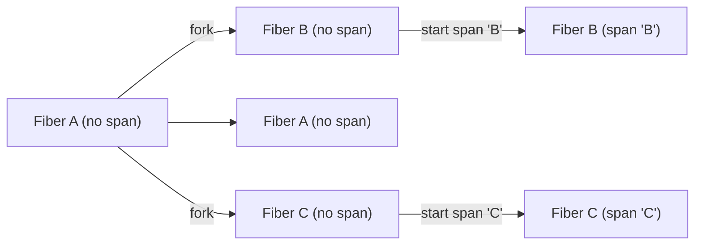

# How otel4s context propagation works

Use the how-to guides for setup and boundary-specific tasks:

- [Keep otel4s context in sync with OpenTelemetry Java](../how-to-jvm-setup/keep-otel4s-context-in-sync-with-opentelemetry-java.md)
- [Use otel4s with Java-instrumented libraries](../how-to-tracing/use-otel4s-with-java-instrumented-libraries.md)
- [Propagate trace context across service boundaries](../how-to-tracing/propagate-trace-context-across-service-boundaries.md)

This page explains how otel4s carries tracing context through effectful code and why some scopes need explicit
re-entry.

## otel4s relies on `Local`

The tracing context propagation logic revolves around [cats.mtl.Local][mtl-local] semantics:

```scala
trait Local[F[_], E] {
  def ask: F[E]
  def local[A](fa: F[A])(f: E => E): F[A]
}
```

It allows us to express and manage local modifications of the tracing context within effectful computations.

For tracing, the environment value is `Context`.
otel4s reads the current `Context` when it decides the parent of a new span, and updates that `Context` while the span
scope is active.

That means context propagation in otel4s follows the semantics of the effect carrier that provides
`Local[F, Context]`.

`Local` works out of the box with [cats.data.Kleisli][kleisli].
On JVM, it also works with [cats.effect.IOLocal][io-local], which is usually the practical default for `IO`
applications.

## The carrier decides how context moves

otel4s does not require one specific carrier.
It needs `Local[F, Context]`, and the carrier defines how local context is copied, inherited, or isolated.

Two common JVM choices are:

- `IOLocal`, which fits ordinary Cats Effect `IO` programs
- `Kleisli`, which fits programs that already thread an explicit environment

`IOLocal` is usually the practical default for applications.
`Kleisli` is useful when your application already models context as part of the effect type.

## Local changes stay on the branch where they happen

Starting a span changes the current tracing context only within the local branch that enters that span scope.
Sibling fibers keep their own current context unless you explicitly propagate something else.

Here is the basic shape:



This is why parent-child relationships in otel4s depend on the current local context at the point where a span is
created.
For the rules that determine parent selection, see
[Choosing parent spans and tracing scopes](choosing-parent-spans-and-tracing-scopes.md).

## Java context and otel4s context are separate by default

On JVM, otel4s and OpenTelemetry Java use different context propagation mechanisms by default:

- otel4s uses `Local`
- OpenTelemetry Java uses `ThreadLocal`

Without extra setup, those two views of the current span do not stay aligned automatically.

For the setup that keeps them in sync, use
[Keep otel4s context in sync with OpenTelemetry Java](../how-to-jvm-setup/keep-otel4s-context-in-sync-with-opentelemetry-java.md).
For boundary patterns that move between otel4s code and Java libraries, use
[Use otel4s with Java-instrumented libraries](../how-to-tracing/use-otel4s-with-java-instrumented-libraries.md).

## Limitations

`Local` works well for ordinary effectful code, but some data types split work into separate stages or branches.
That matters for `Resource` and `fs2.Stream`.

The current encoding of [cats.effect.Resource][resource] is incompatible with `Local` semantics.
For example, you may want one lifecycle span to cover acquire, use, and release:

```text
> resource
  > acquire
  > use
    > inner spans
  > release
```

That shape does not happen automatically just because the resource was created under a span.
The `use` body or sub-stream often needs explicit re-entry into the captured span scope.

That is why otel4s exposes helpers such as `trace`, `mapK(trace)`, and `translate(trace)` for these cases.
For the detailed reasoning and examples, see
[Tracing Resource and fs2.Stream scopes](tracing-resource-and-fs2-stream-scopes.md) and
[Trace Resource and fs2.Stream code](../how-to-tracing/trace-resource-and-fs2-stream-code.md).

[mtl-local]: https://typelevel.org/cats-mtl/mtl-classes/local.html
[io-local]: https://typelevel.org/cats-effect/docs/core/io-local
[kleisli]: https://typelevel.org/cats/datatypes/kleisli.html
[resource]: https://typelevel.org/cats-effect/docs/std/resource
