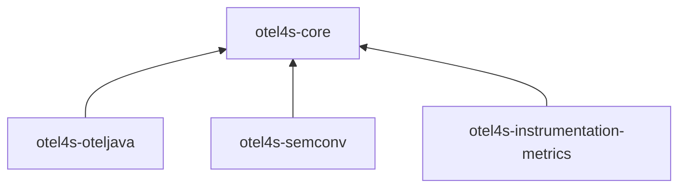

# Modules and module families

otel4s splits its published artifacts into module families so libraries and applications can depend on only the
pieces they need.

The main distinction is between:

- API modules, which define backend-agnostic tracing, metrics, and logs interfaces
- backend modules, which implement those interfaces
- supporting modules, which provide semantic conventions, instrumentation helpers, and testing utilities

That split keeps application dependencies explicit and lets library authors instrument code without forcing a
specific telemetry backend on their users.

## Main entry points

Most users start with one of these module families:

- `otel4s-core*` defines the core otel4s APIs such as [Tracer][tracer-github], [Meter][meter-github], and logging
  interfaces. Use these modules when you are instrumenting a library or writing backend-agnostic code.
- `otel4s-oteljava*` implements those APIs on top of [OpenTelemetry Java][otel-java]. Use these modules when you are
  building a JVM application that needs a production telemetry backend.

Within this repository, `otel4s-oteljava` is the main backend. It is JVM-only.

If you need a backend for Scala.js or Scala Native, use the separate
[`otel4s-sdk`](https://typelevel.org/otel4s-sdk/sdk/overview.html) project. It builds on `otel4s-core`, but it is
published from a different repository.

## How the families relate

The published modules in this repository fall into a few groups:

- `otel4s-core*` provides backend-agnostic APIs and no-op implementations
- `otel4s-oteljava*` provides the JVM backend and OpenTelemetry Java integration
- `otel4s-semconv*` provides generated semantic attribute keys and metric specs
- `otel4s-instrumentation-*` provides ready-to-use instrumentation helpers
- `otel4s-oteljava-testkit` and the signal-specific testkits provide in-memory exporters and expectation APIs for
  tests
- `otel4s-oteljava-context-storage` supports JVM interop scenarios where otel4s context must stay aligned with
  OpenTelemetry Java context

At a high level, the dependency flow looks like this:

Some families are further split by signal. For example, `otel4s-core` and `otel4s-oteljava` both have tracing,
metrics, and logs variants, plus shared internal modules such as `*-common`. Most users do not need to think about
that structure until they want a smaller dependency surface for one specific signal.

## Which module do I need?

Use the smallest module that matches your job:

| Use case | Start with | Why |
|---|---|---|
| Library instrumentation for tracing only | `otel4s-core-trace` | Depends only on the tracing API |
| Library instrumentation for metrics only | `otel4s-core-metrics` | Depends only on the metrics API |
| Library instrumentation for logs only | `otel4s-core-logs` | Depends only on the logs API |
| Library instrumentation for multiple signals | `otel4s-core` | Aggregates the core signal APIs |
| JVM application exporting telemetry | `otel4s-oteljava` | Main backend in this repo |
| Scala.js or Scala Native application exporting telemetry | `otel4s-sdk` | Cross-platform backend published from the separate `otel4s-sdk` repo |
| JVM tests that need to assert exported telemetry | `otel4s-oteljava-testkit` | Provides in-memory exporters and expectation APIs |

If you are unsure, a useful rule of thumb is:

- if you are publishing a library, start with `otel4s-core*`
- if you are running a JVM application, start with `otel4s-oteljava`
- if you are running a Scala.js or Scala Native application, start with
  [`otel4s-sdk`](https://typelevel.org/otel4s-sdk/sdk/overview.html)

## Related modules

Some module families are usually added after you have chosen a backend:

- Use [Semantic conventions](../instrumentation/semantic-conventions.md) when you want generated attribute keys or
  metric specs from the OpenTelemetry semantic conventions
- Use [Testkit](../oteljava/testkit.md) when you want to assert exported telemetry in tests
- Use [The JVM backend](oteljava-jvm-backend.md) when you need JVM-specific backend details

## Next steps

- To set up the JVM backend in an application, follow [Set up otel4s in a JVM application](../how-to-jvm-setup/set-up-otel4s-in-a-jvm-application.md)
- To set up a Scala.js or Scala Native application, use the
  [`otel4s-sdk` documentation](https://typelevel.org/otel4s-sdk/sdk/overview.html)
- To use an existing OpenTelemetry Java SDK instance, follow [Use the global OpenTelemetry instance](../how-to-jvm-setup/use-the-global-opentelemetry-instance.md)
- To record metrics or create spans, use the [Metrics](../how-to-metrics/index.md) and [Tracing](../how-to-tracing/index.md)
  how-to sections

[tracer-github]: https://github.com/typelevel/otel4s/blob/main/core/trace/src/main/scala/org/typelevel/otel4s/trace/Tracer.scala
[meter-github]: https://github.com/typelevel/otel4s/blob/main/core/metrics/src/main/scala/org/typelevel/otel4s/metrics/Meter.scala
[otel-java]: https://github.com/open-telemetry/opentelemetry-java
