# Root spans and tracing scopes

Use [Create spans around effectful code](../how-to-tracing/create-spans-around-effectful-code.md) for the step-by-step examples.

This page explains how otel4s chooses the parent of a new span, and what changes when you use `childScope`,
`rootScope`, `rootSpan`, or `noopScope`.

## `span` follows the current tracing context

`Tracer[F].span("...")` checks the current tracing context.
If it finds a valid parent span, the new span becomes its child.
Otherwise, it starts a root span.

```scala mdoc:silent:reset
import cats.Monad
import cats.effect.IO
import cats.effect.Ref
import cats.syntax.flatMap._
import cats.syntax.functor._
import org.typelevel.otel4s.Attribute
import org.typelevel.otel4s.trace.{SpanContext, Tracer}

case class User(email: String)

class UserRepository[F[_]: Monad: Tracer](storage: Ref[F, Map[Long, User]]) {

  def findUser(userId: Long): F[Option[User]] =
    Tracer[F].span("find-user", Attribute("user_id", userId)).use { span =>
      for {
        current <- storage.get
        user <- Monad[F].pure(current.get(userId))
        _ <- span.addAttribute(Attribute("user_exists", user.isDefined))
      } yield user
    }

}
```

`findUser` creates `find-user` as a child span when another span is current.
If no parent is current, `find-user` becomes a root span.

## `rootScope` and `rootSpan` solve different problems

`rootScope` does not create a span.
It only runs an effect in a scope where the current parent is cleared.

`rootSpan("...").surround(fa)` creates a new root span and makes it current while `fa` runs.

```scala mdoc:silent
class UserRequestHandler[F[_]: Tracer: Monad](repo: UserRepository[F]) {
  private val SystemUserId = -1L

  def handleUser(userId: Long): F[Unit] =
    Tracer[F].rootScope(activateUser(userId))

  def handleUserInternal(userId: Long): F[Unit] =
    Tracer[F].rootSpan("handle-user").surround(activateUser(userId))

  private def activateUser(userId: Long): F[Unit] =
    for {
      systemUser <- repo.findUser(SystemUserId)
      user <- repo.findUser(userId)
      _ <- activate(systemUser, user)
    } yield ()

  private def activate(systemUser: Option[User], target: Option[User]): F[Unit] = {
    val _ = (systemUser, target)
    Monad[F].unit
  }
}
```

With `rootScope`, the current parent is removed, but no replacement span is created.
That means each `find-user` span inside `activateUser` becomes its own root span:

```mermaid
gantt
    dateFormat HH:mm:ss
    axisFormat %H:%M:%S

    section Span 1
    find-user { user_id = -1 }     :done, a1, 00:00:00, 00:00:10
    section Span 2
    find-user { user_id = 123 }    :done, a2, 00:00:00, 00:00:10
```



With `rootSpan`, `handle-user` becomes the new current span, so the inner `find-user` spans become its children:

```mermaid
gantt
    dateFormat HH:mm:ss
    axisFormat %H:%M:%S

    section Spans
    handle-user                    :done, a1, 00:00:00, 00:00:10
    find-user { user_id = -1 }     :done, a2, 00:00:01, 00:00:10
    find-user { user_id = 123 }    :done, a3, 00:00:01, 00:00:10
```



Use `rootScope` when work should stop inheriting the current parent, but you do not want a wrapper span.
Use `rootSpan` when that work should start a new trace with one explicit root span.

## `noopScope` disables tracing inside a block

`noopScope` is different from `rootScope`.
It does not create new root spans.
Tracing operations inside the block become no-ops.

```scala mdoc:silent
class InternalUserService[F[_]: Tracer](repo: UserRepository[F]) {

  def findUserInternal(userId: Long): F[Option[User]] =
    Tracer[F].noopScope(repo.findUser(userId))

}
```

Use it when code should run without emitting spans even if tracing is enabled in the surrounding application.

## `childScope` sets a specific parent

`childScope` is the lower-level scope API.
Use it when you already have a `SpanContext` and want spans in a block to use that context as their parent.

```scala mdoc:silent
def continueFrom(parent: SpanContext)(implicit tracer: Tracer[IO]): IO[Unit] =
  Tracer[IO].childScope(parent) {
    Tracer[IO].span("continued-work").use_
  }
```

This is useful when the parent span is known explicitly rather than taken from the current tracing context.
