```mermaid
gantt
    dateFormat HH:mm:ss
    axisFormat %H:%M:%S

    section Spans
    root-span  :done, a1, 00:00:00, 00:00:10
    inner-span :done, a2, 00:00:02, 00:00:08
```

```mermaid
gantt
    dateFormat HH:mm:ss
    axisFormat %H:%M:%S

    section root-a
    root-a  :done, a1, 00:00:00, 00:00:10
    stage-1 :done, a2, 00:00:01, 00:00:04
    stage-2 :done, a3, 00:00:05, 00:00:09

    section root-b
    root-b  :done, a4, 00:00:00, 00:00:11
    stage-1 :done, a5, 00:00:02, 00:00:05
    stage-2 :done, a6, 00:00:06, 00:00:10
```

# Tracing Resource and fs2.Stream scopes

Use [Trace Resource and fs2.Stream code](../how-to-tracing/trace-resource-and-fs2-stream-code.md) for the step-by-step examples.

This page explains why `trace`, `mapK`, and `translate` matter when spans cross `Resource` and `fs2.Stream`
boundaries.

## Resource scopes are not re-entered automatically

`Tracer[F].span("...").resource` gives you a managed span and a `trace` function that re-enters that span scope.

A `Resource.use` body does not automatically run with that span as current.
See [issue #194](https://github.com/typelevel/otel4s/issues/194) for background.

```scala mdoc:silent
import cats.effect._
import cats.syntax.functor._
import org.typelevel.otel4s.trace.{SpanOps, Tracer}

def withResourceWithoutTrace[F[_]: Async: Tracer]: F[Unit] =
  Tracer[F]
    .span("my-resource-span")
    .resource
    .use { case SpanOps.Res(_, _) =>
      // outside the resource span scope
      Tracer[F].currentSpanContext // returns `None`
    }
    .void
```

To run the inner effect under that span, re-enter the scope explicitly:

```scala mdoc:silent
def withResourceWithTrace[F[_]: Async: Tracer]: F[Unit] =
  Tracer[F]
    .span("my-resource-span")
    .resource
    .use { case SpanOps.Res(_, trace) =>
      // inside the resource span scope
      trace(Tracer[F].currentSpanContext) // returns `Some(SpanContext{traceId="...", ...})`
    }
    .void
```

## `mapK(trace)` and `res.trace(...)` cover different parts of a resource

If a resource has traced acquire and release steps, `mapK(trace)` runs those steps under the captured parent span.
To keep the effect passed to `.use` under that same parent span, wrap that effect in `res.trace(...)` too.

```scala mdoc:silent:reset
import cats.effect._
import org.typelevel.otel4s.trace.Tracer

class Connection[F[_]: Tracer] {
  def run[A](f: Connection[F] => F[A]): F[A] =
    Tracer[F].span("connection.operation").surround(f(this))
}

object Connection {
  def create[F[_]: Async: Tracer]: Resource[F, Connection[F]] =
    Resource.make(
      Tracer[F].span("connection.acquire").surround(Async[F].pure(new Connection[F]))
    )(_ => Tracer[F].span("connection.release").surround(Async[F].unit))
}

class App[F[_]: Async: Tracer] {
  def withConnection[A](f: Connection[F] => F[A]): F[A] =
    (for {
      r <- Tracer[F].span("connection.lifecycle").resource
      c <- Connection.create[F].mapK(r.trace)
    } yield (r, c)).use { case (res, connection) =>
      res.trace(Tracer[F].span("connection.use").surround(connection.run(f)))
    }
}
```

Resulting spans:



```mermaid
gantt
    dateFormat HH:mm:ss
    axisFormat %H:%M:%S

    section Spans
    connection.lifecycle :done, a1, 00:00:00, 00:00:10
    connection.acquire   :done, a2, 00:00:00, 00:00:03
    connection.use       :done, a3, 00:00:03, 00:00:08
    connection.operation :done, a4, 00:00:04, 00:00:08
    connection.release   :done, a5, 00:00:08, 00:00:10
```

## Another resource pattern: one lifecycle span for startup, run, and shutdown

For long-lived components, keep the lifecycle handle and use it in both `mapK(lifecycle.trace)` and
`lifecycle.trace(...)`.

```scala mdoc:silent
import org.typelevel.otel4s.trace.SpanOps

class Transactor[F[_]]
class Redis[F[_]]

def createTransactor[F[_]: Async: Tracer]: Resource[F, Transactor[F]] =
  Resource.make(
    Tracer[F].span("transactor.acquire").surround(Async[F].pure(new Transactor[F]))
  )(_ => Tracer[F].span("transactor.release").surround(Async[F].unit))

def createRedis[F[_]: Async: Tracer]: Resource[F, Redis[F]] =
  Resource.make(
    Tracer[F].span("redis.acquire").surround(Async[F].pure(new Redis[F]))
  )(_ => Tracer[F].span("redis.release").surround(Async[F].unit))

def components[F[_]: Async: Tracer]: Resource[F, (SpanOps.Res[F], Transactor[F], Redis[F])] =
  for {
    lifecycle <- Tracer[F].span("app.lifecycle").resource
    tx <- createTransactor[F].mapK(lifecycle.trace)
    redis <- createRedis[F].mapK(lifecycle.trace)
  } yield (lifecycle, tx, redis)

def run[F[_]: Async: Tracer]: F[Unit] =
  components[F].use { case (lifecycle, _ /* transactor */, _ /* redis */) =>
    lifecycle.trace(Tracer[F].span("app.run").surround(Async[F].unit))
  }
```

Resulting spans:



```mermaid
gantt
    dateFormat HH:mm:ss
    axisFormat %H:%M:%S

    section app.lifecycle
    app.lifecycle      :done, a1, 00:00:00, 00:00:26
    transactor.acquire :done, a2, 00:00:00, 00:00:06
    redis.acquire      :done, a3, 00:00:06, 00:00:10
    app.run            :done, a4, 00:00:10, 00:00:15
    redis.release      :done, a5, 00:00:15, 00:00:19
    transactor.release :done, a6, 00:00:19, 00:00:26
```

If you leave `app.run` outside `lifecycle.trace(...)`, it becomes a separate root span.

## `translate(trace)` re-enters a captured span for a sub-stream

A stream built from `Stream.resource(Tracer[F].span("...").resource)` has the same issue as `Resource.use`: the
sub-stream does not automatically run with that span as current.

`translate(trace)` applies the captured scope to the branch that should run under it.

```scala mdoc:silent:reset
import cats.effect.Async
import fs2.Stream
import org.typelevel.otel4s.trace.{SpanOps, Tracer}

def stream[F[_]: Async: Tracer]: Stream[F, Unit] =
  Stream
    .resource(Tracer[F].span("root-span").resource)
    .flatMap { case SpanOps.Res(_, trace) =>
      Stream("inner")
        .evalMap { _ =>
          Tracer[F].span("inner-span").use_
        }
        .translate(trace)
    }
```

Resulting spans:



## `flatMap` is often where you create the sub-stream

In `fs2`, `flatMap` is often where you build a new branch, so it is a common place to call `translate(trace)`.
The important part is the new branch itself, not `flatMap` as a special case.

Practical rule:

- When a sub-stream should keep the captured parent span, apply `.translate(trace)` where you create that sub-stream.
- If that sub-stream creates another span resource, use that span's own `trace` function for deeper nested work.

That keeps parent-child relationships explicit.

## Sequential stages are siblings unless you nest spans

In this pipeline, `stage-1` and `stage-2` are siblings under the same root span.
They only become parent and child if `stage-2` is created while `stage-1` is still current.

```scala mdoc:silent:reset
import cats.effect.Async
import fs2.Stream
import org.typelevel.otel4s.trace.{SpanOps, Tracer}

def pipeline[F[_]: Async: Tracer]: F[Unit] =
  Stream("a", "b")
    .covary[F]
    .flatMap { element =>
      Stream
        .resource(Tracer[F].span(s"root-$element").resource)
        .flatMap { case SpanOps.Res(_, trace) =>
          Stream(element)
            .evalMap(_ => Tracer[F].span("stage-1").use_)
            .evalMap(_ => Tracer[F].span("stage-2").use_)
            .translate(trace)
        }
    }
    .compile
    .drain
```

Resulting spans:



```mermaid
gantt
    dateFormat HH:mm:ss
    axisFormat %H:%M:%S

    section root-a
    root-a  :done, a1, 00:00:00, 00:00:10
    stage-1 :done, a2, 00:00:01, 00:00:04
    stage-2 :done, a3, 00:00:05, 00:00:09

    section root-b
    root-b  :done, a4, 00:00:11, 00:00:21
    stage-1 :done, a5, 00:00:12, 00:00:15
    stage-2 :done, a6, 00:00:16, 00:00:20
```

## Parallel branches can finish in any order

In `parJoin`, each branch still keeps the span lineage you established before the branch was created. What changes is the
timing: sibling roots and their child spans can overlap, and completion order is not guaranteed.

```scala mdoc:silent
def parallelPipeline[F[_]: Async: Tracer]: F[Unit] =
  Stream("a", "b")
    .covary[F]
    .map { element =>
      Stream
        .resource(Tracer[F].span(s"root-$element").resource)
        .flatMap { case SpanOps.Res(_, trace) =>
          Stream(element)
            .evalMap(_ => Tracer[F].span("stage-1").use_)
            .evalMap(_ => Tracer[F].span("stage-2").use_)
            .translate(trace)
        }
    }
    .parJoin(2)
    .compile
    .drain
```

One possible timing layout is:



## Cancellation changes duration, not parentage

If a branch is canceled while one of its spans is still active:

- That span ends early.
- The canceled branch keeps the same parent lineage it had before cancellation.
- Sibling branches continue independently under their own translated scope.

So the main rule stays the same: create each parallel branch inside the scope you want it to keep. After that,
completion order and cancellation may change timing, but they do not re-parent spans across branches.
