# Tracing Resource and fs2.Stream scopes

Use [Trace Resource and fs2.Stream code](../how-to-tracing/trace-resource-and-fs2-stream-code.md) for the task itself.

This page explains why `trace`, `mapK`, and `translate` are needed when spans cross `Resource` and `fs2.Stream`
boundaries.

## Resource scopes do not stay aligned automatically

`Tracer[F].span("...").resource` gives you a managed span plus a `trace` function that re-enters that span scope.

That extra step is needed because a `Resource` closure does not automatically inherit the current tracing scope in the
same way as a plain effect. The `Resource` abstraction is leaky here with respect to fiber context propagation.

```scala mdoc:silent
import cats.effect._
import cats.syntax.functor._
import org.typelevel.otel4s.trace.{SpanOps, Tracer}

def withResourceWithoutTrace[F[_]: Async: Tracer]: F[Unit] =
  Tracer[F].span("my-resource-span").resource.use { case SpanOps.Res(_, _) =>
    Tracer[F].currentSpanContext.void
  }
```

To run the inner effect under that span, re-enter the scope explicitly:

```scala mdoc:silent
def withResourceWithTrace[F[_]: Async: Tracer]: F[Unit] =
  Tracer[F].span("my-resource-span").resource.use { case SpanOps.Res(_, trace) =>
    trace(Tracer[F].currentSpanContext).void
  }
```

## `mapK(trace)` keeps acquire, use, and release under the same parent span

If a resource has traced acquire and release steps, `mapK(trace)` lets you run both of them under the captured parent
span.

```scala mdoc:silent:reset
import cats.effect._
import org.typelevel.otel4s.trace.Tracer

class Connection[F[_]: Tracer] {
  def use[A](f: Connection[F] => F[A]): F[A] =
    Tracer[F].span("use_conn").surround(f(this))
}

object Connection {
  def create[F[_]: Async: Tracer]: Resource[F, Connection[F]] =
    Resource.make(
      Tracer[F].span("acquire").surround(Async[F].pure(new Connection[F]))
    )(_ => Tracer[F].span("release").surround(Async[F].unit))
}

class App[F[_]: Async: Tracer] {
  def withConnection[A](f: Connection[F] => F[A]): F[A] =
    (for {
      r <- Tracer[F].span("resource").resource
      c <- Connection.create[F].mapK(r.trace)
    } yield (r, c)).use { case (res, connection) =>
      res.trace(Tracer[F].span("use").surround(connection.use(f)))
    }
}
```

Expected span structure:



```mermaid
gantt
    dateFormat HH:mm:ss
    axisFormat %H:%M:%S

    section Spans
    resource :done, a1, 00:00:00, 00:00:10
    acquire  :done, a2, 00:00:00, 00:00:03
    use      :done, a3, 00:00:03, 00:00:08
    use_conn :done, a4, 00:00:04, 00:00:08
    release  :done, a5, 00:00:08, 00:00:10
```

## Another resource pattern: startup and shutdown spans under one lifecycle span

If you need one long-lived lifecycle span plus traced startup and shutdown of multiple resources, the same `mapK(trace)`
pattern applies.

```scala mdoc:silent
class Transactor[F[_]]
class Redis[F[_]]

def createTransactor[F[_]: Async: Tracer]: Resource[F, Transactor[F]] =
  Resource.make(
    Tracer[F].span("transactor#acquire").surround(Async[F].pure(new Transactor[F]))
  )(_ => Tracer[F].span("transactor#release").surround(Async[F].unit))

def createRedis[F[_]: Async: Tracer]: Resource[F, Redis[F]] =
  Resource.make(
    Tracer[F].span("redis#acquire").surround(Async[F].pure(new Redis[F]))
  )(_ => Tracer[F].span("redis#release").surround(Async[F].unit))

def components[F[_]: Async: Tracer]: Resource[F, (Transactor[F], Redis[F])] =
  for {
    r <- Tracer[F].span("app_lifecycle").resource
    tx <- createTransactor[F].mapK(r.trace)
    redis <- createRedis[F].mapK(r.trace)
  } yield (tx, redis)

def run[F[_]: Async: Tracer]: F[Unit] =
  components[F].use { case (_ /* transactor */, _ /* redis */) =>
    Tracer[F].span("app_run").surround(Async[F].unit)
  }
```

Expected span structure:



```mermaid
gantt
    dateFormat HH:mm:ss
    axisFormat %H:%M:%S

    section app_lifecycle
    app_lifecycle      :done, a1, 00:00:00, 00:00:26
    transactor#acquire :done, a2, 00:00:00, 00:00:06
    redis#acquire      :done, a3, 00:00:06, 00:00:10
    redis#release      :done, a4, 00:00:15, 00:00:19
    transactor#release :done, a5, 00:00:19, 00:00:26

    section app_run
    app_run            :done, a6, 00:00:10, 00:00:15
```

`app_run` and `app_lifecycle` are separate spans. The lifecycle span remains active until the resource is released.

## `translate(trace)` re-enters the scope for a stream branch

In `fs2.Stream`, a new branch can evaluate effects outside the span you started earlier unless you re-enter the scope at
that branch.

`translate(trace)` is that re-entry point.

```scala mdoc:silent:reset
import cats.effect.Async
import fs2.Stream
import org.typelevel.otel4s.trace.{SpanOps, Tracer}

def stream[F[_]: Async: Tracer]: Stream[F, Unit] =
  Stream
    .resource(Tracer[F].span("root-span").resource)
    .flatMap { case SpanOps.Res(_, trace) =>
      Stream("inner")
        .evalMap { _ =>
          Tracer[F].span("inner-span").use_
        }
        .translate(trace)
    }
```

Expected span structure:



```mermaid
gantt
    dateFormat HH:mm:ss
    axisFormat %H:%M:%S

    section Spans
    root-span  :done, a1, 00:00:00, 00:00:10
    inner-span :done, a2, 00:00:02, 00:00:08
```

## `flatMap` boundaries are the important stream boundaries

`flatMap` often introduces the point where a new stream branch starts.

Practical rule:

- when a sub-stream should keep the captured parent span, apply `.translate(trace)` at that branch
- if that sub-stream creates another span resource, use that span's own `trace` function for deeper nested work

That keeps parent-child relationships explicit instead of relying on accidental scope carry-over.

## Sequential stages stay siblings unless you nest spans

If two `evalMap` stages each create their own span, they are usually siblings under the same parent span.
They are not parent and child unless one stage creates the next span while its own span is still current.

```scala mdoc:silent:reset
import cats.effect.Async
import fs2.Stream
import org.typelevel.otel4s.trace.{SpanOps, Tracer}

def pipeline[F[_]: Async: Tracer]: F[Unit] =
  Stream("a", "b")
    .covary[F]
    .flatMap { element =>
      Stream
        .resource(Tracer[F].span(s"root-$element").resource)
        .flatMap { case SpanOps.Res(_, trace) =>
          Stream(element)
            .evalMap(_ => Tracer[F].span("stage-1").use_)
            .evalMap(_ => Tracer[F].span("stage-2").use_)
            .translate(trace)
        }
    }
    .compile
    .drain
```

Expected span structure:



```mermaid
gantt
    dateFormat HH:mm:ss
    axisFormat %H:%M:%S

    section root-a
    root-a  :done, a1, 00:00:00, 00:00:10
    stage-1 :done, a2, 00:00:01, 00:00:04
    stage-2 :done, a3, 00:00:05, 00:00:09

    section root-b
    root-b  :done, a4, 00:00:11, 00:00:21
    stage-1 :done, a5, 00:00:12, 00:00:15
    stage-2 :done, a6, 00:00:16, 00:00:20
```

## Parallel branches can finish in any order

In `parJoin`, each branch still keeps the span lineage you established before the branch was created. What changes is the
timing: sibling roots and their child spans can overlap, and completion order is not guaranteed.

```scala mdoc:silent
def parallelPipeline[F[_]: Async: Tracer]: F[Unit] =
  Stream("a", "b")
    .covary[F]
    .map { element =>
      Stream
        .resource(Tracer[F].span(s"root-$element").resource)
        .flatMap { case SpanOps.Res(_, trace) =>
          Stream(element)
            .evalMap(_ => Tracer[F].span("stage-1").use_)
            .evalMap(_ => Tracer[F].span("stage-2").use_)
            .translate(trace)
        }
    }
    .parJoin(2)
    .compile
    .drain
```

One possible span structure is:

```mermaid
gantt
    dateFormat HH:mm:ss
    axisFormat %H:%M:%S

    section root-a
    root-a  :done, a1, 00:00:00, 00:00:10
    stage-1 :done, a2, 00:00:01, 00:00:04
    stage-2 :done, a3, 00:00:05, 00:00:09

    section root-b
    root-b  :done, a4, 00:00:00, 00:00:11
    stage-1 :done, a5, 00:00:02, 00:00:05
    stage-2 :done, a6, 00:00:06, 00:00:10
```



## Cancellation affects the branch that was canceled

Cancellation changes span lifetime, not parentage.

If a branch is canceled while one of its spans is still active:

- that span is ended early
- the canceled branch keeps the same parent lineage it had before cancellation
- sibling branches continue independently under their own translated scope

So the main rule stays the same: create each parallel branch inside the scope you want it to keep. After that,
completion order and cancellation may change timing, but they do not re-parent spans across branches.
