```mermaid
gantt
    dateFormat HH:mm:ss
    axisFormat %H:%M:%S

    section Spans
    my-resource-span :done, a1, 00:00:00, 00:00:10
```

# Trace Resource and fs2.Stream code

Use this page when tracing code that crosses `Resource` or `fs2.Stream` boundaries.

A span created with `Tracer[F].span("...").resource` stays managed by the `Resource`, but the effect inside
`Resource#use` does not automatically run with that span as current.

Use `trace` to re-enter that span scope. The same idea applies when you build an `fs2.Stream` branch from a captured
span resource.

## Prerequisites

- [Set up otel4s in a JVM application](../how-to-jvm-setup/set-up-otel4s-in-a-jvm-application.md)
- [Create spans around effectful code](create-spans-around-effectful-code.md)

## 1. Re-enter the span inside `Resource#use`

`Tracer[F].span("...").resource` gives you a managed span and a `trace` function that re-enters that span scope.

Without `trace`, the effect inside `use` runs outside that span scope.

```scala mdoc:silent:reset
import cats.effect._
import cats.syntax.functor._
import org.typelevel.otel4s.trace.{SpanOps, Tracer}

def withResourceWithoutTrace[F[_]: Async: Tracer]: F[Unit] =
  Tracer[F]
    .span("my-resource-span")
    .resource
    .use { case SpanOps.Res(_, _) =>
      // outside the resource span scope
      Tracer[F].currentSpanContext // returns `None`
    }
    .void
```

To run the inner effect under that span, re-enter the scope explicitly:

```scala mdoc:silent
def withResourceWithTrace[F[_]: Async: Tracer]: F[Unit] =
  Tracer[F]
    .span("my-resource-span")
    .resource
    .use { case SpanOps.Res(_, trace) =>
      // inside the resource span scope
      trace(Tracer[F].currentSpanContext) // returns `Some(SpanContext{traceId="...", ...})`
    }
    .void
```

Span structure:



## 2. Keep acquire, use, and release under one parent span

Use `mapK(r.trace)` so acquire and release run under the lifecycle span, and wrap the `use` body with
`res.trace(...)` so the main work does too.

```scala mdoc:silent:reset
import cats.effect._
import org.typelevel.otel4s.trace.Tracer

class Connection[F[_]: Tracer] {
  def run[A](f: Connection[F] => F[A]): F[A] =
    Tracer[F].span("connection.operation").surround(f(this))
}

object Connection {
  def create[F[_]: Async: Tracer]: Resource[F, Connection[F]] =
    Resource.make(
      Tracer[F].span("connection.acquire").surround(Async[F].pure(new Connection[F]))
    )(_ => Tracer[F].span("connection.release").surround(Async[F].unit))
}

class App[F[_]: Async: Tracer] {
  def withConnection[A](f: Connection[F] => F[A]): F[A] =
    (for {
      r <- Tracer[F].span("connection.lifecycle").resource
      c <- Connection.create[F].mapK(r.trace)
    } yield (r, c)).use { case (res, connection) =>
      res.trace(Tracer[F].span("connection.use").surround(connection.run(f)))
    }
}
```

This keeps acquire, use, and release under the same parent span.

Span structure:



```mermaid
gantt
    dateFormat HH:mm:ss
    axisFormat %H:%M:%S

    section Spans
    connection.lifecycle :done, a1, 00:00:00, 00:00:10
    connection.acquire   :done, a2, 00:00:00, 00:00:03
    connection.use       :done, a3, 00:00:03, 00:00:08
    connection.operation :done, a4, 00:00:04, 00:00:08
    connection.release   :done, a5, 00:00:08, 00:00:10
```

## 3. Re-enter the span scope for a stream branch

If you build a sub-stream from `Stream.resource(Tracer[F].span("...").resource)`, apply `translate(trace)` to the
branch that should run under that span.

```scala mdoc:silent:reset
import cats.effect.Async
import fs2.Stream
import org.typelevel.otel4s.trace.{SpanOps, Tracer}

def stream[F[_]: Async: Tracer]: Stream[F, Unit] =
  Stream
    .resource(Tracer[F].span("root-span").resource)
    .flatMap { case SpanOps.Res(_, trace) =>
      Stream("inner")
        .evalMap { _ =>
          // creates a child span of `root-span`
          Tracer[F].span("inner-span").use_
        }
        .translate(trace)
    }
```

Use `translate(trace)` where that sub-stream starts. You do not need it on every stream operation, only on the branch
that should run in the captured scope.

Span structure:



```mermaid
gantt
    dateFormat HH:mm:ss
    axisFormat %H:%M:%S

    section Spans
    root-span  :done, a1, 00:00:00, 00:00:10
    inner-span :done, a2, 00:00:02, 00:00:08
```

## What's next

- Keep a span open until later code finishes the work:
  [Use unmanaged spans when a span must end outside its scope](use-unmanaged-spans-when-a-span-must-end-outside-its-scope.md)
- Continue incoming traces and propagate them downstream:
  [Propagate trace context across service boundaries](propagate-trace-context-across-service-boundaries.md)
- Work with Java libraries that depend on OpenTelemetry context:
  [Use otel4s with Java-instrumented libraries](use-otel4s-with-java-instrumented-libraries.md)
- For more background on `trace`, `mapK`, and `translate`, see
  [Tracing Resource and fs2.Stream scopes](../explanations/tracing-resource-and-fs2-stream-scopes.md).
