# Trace Resource and fs2.Stream code

Use this page when your spans need to stay correct across `Resource` or `fs2.Stream` boundaries.

`Tracer[F].span("...").resource` captures a span, but `Resource.use` does not automatically make that span current
again.

As a result, work inside the `use` block can run without the expected parent span unless you re-enter the scope with
`trace`. The same pattern applies to some `fs2.Stream` boundaries.

## Prerequisites

- [Set up otel4s in a JVM application](../how-to-jvm-setup/set-up-otel4s-in-a-jvm-application.md)
- [Create spans around effectful code](create-spans-around-effectful-code.md)

## 1. Re-enter the captured span inside `Resource.use`

`Tracer[F].span("...").resource` gives you a managed span plus a `trace` function that re-enters that span scope.

Without `trace`, the `Resource` closure does not automatically inherit the current span.

```scala mdoc:silent:reset
import cats.effect._
import cats.syntax.functor._
import org.typelevel.otel4s.trace.{SpanOps, Tracer}

def withResourceWithoutTrace[F[_]: Async: Tracer]: F[Unit] =
  Tracer[F].span("my-resource-span").resource.use { case SpanOps.Res(_, _) =>
    Tracer[F].currentSpanContext // returns `None`
      .void
  }
```

To run the inner effect under that span, re-enter the scope explicitly:

```scala mdoc:silent
def withResourceWithTrace[F[_]: Async: Tracer]: F[Unit] =
  Tracer[F].span("my-resource-span").resource.use { case SpanOps.Res(_, trace) =>
    trace(Tracer[F].currentSpanContext) // returns `Some(SpanContext{traceId="...", ...})`
      .void
  }
```

Expected span structure:



```mermaid
gantt
    dateFormat HH:mm:ss
    axisFormat %H:%M:%S

    section Spans
    my-resource-span :done, a1, 00:00:00, 00:00:10
```

## 2. Trace acquire, use, and release under the same parent span

When you want structured lifecycle spans, apply `trace` to the resource with `mapK(...)`.

```scala mdoc:silent:reset
import cats.effect._
import org.typelevel.otel4s.trace.Tracer

class Connection[F[_]: Tracer] {
  def use[A](f: Connection[F] => F[A]): F[A] =
    Tracer[F].span("use_conn").surround(f(this))
}

object Connection {
  def create[F[_]: Async: Tracer]: Resource[F, Connection[F]] =
    Resource.make(
      Tracer[F].span("acquire").surround(Async[F].pure(new Connection[F]))
    )(_ => Tracer[F].span("release").surround(Async[F].unit))
}

class App[F[_]: Async: Tracer] {
  def withConnection[A](f: Connection[F] => F[A]): F[A] =
    (for {
      r <- Tracer[F].span("resource").resource
      c <- Connection.create[F].mapK(r.trace)
    } yield (r, c)).use { case (res, connection) =>
      res.trace(Tracer[F].span("use").surround(connection.use(f)))
    }
}
```

This keeps acquire, use, and release under the same parent span.

Expected span structure:



```mermaid
gantt
    dateFormat HH:mm:ss
    axisFormat %H:%M:%S

    section Spans
    resource :done, a1, 00:00:00, 00:00:10
    acquire  :done, a2, 00:00:00, 00:00:03
    use      :done, a3, 00:00:03, 00:00:08
    use_conn :done, a4, 00:00:04, 00:00:08
    release  :done, a5, 00:00:08, 00:00:10
```

## 3. Re-enter the span scope at `fs2.Stream` boundaries

Use `Stream#translate(...)` with the captured `trace` function when a stream branch should keep the same parent span.

```scala mdoc:silent:reset
import cats.effect.Async
import fs2.Stream
import org.typelevel.otel4s.trace.{SpanOps, Tracer}

def stream[F[_]: Async: Tracer]: Stream[F, Unit] =
  Stream
    .resource(Tracer[F].span("root-span").resource)
    .flatMap { case SpanOps.Res(_, trace) =>
      Stream("inner")
        .evalMap { _ =>
          // creates a child span of the "root-span"  
          Tracer[F].span("inner-span").use_
        }
        .translate(trace)
    }
```

Apply `translate(trace)` at the branch where the inner stream should run under the captured span.

Expected span structure:



```mermaid
gantt
    dateFormat HH:mm:ss
    axisFormat %H:%M:%S

    section Spans
    root-span  :done, a1, 00:00:00, 00:00:10
    inner-span :done, a2, 00:00:02, 00:00:08
```

## What's next

- Continue incoming traces and propagate them downstream:
  [Propagate trace context across service boundaries](propagate-trace-context-across-service-boundaries.md)
- Work with Java libraries that depend on OpenTelemetry context:
  [Use otel4s with Java-instrumented libraries](use-otel4s-with-java-instrumented-libraries.md)
- For more background on `trace`, `mapK`, and `translate`, see
  [Tracing Resource and fs2.Stream scopes](../explanations/tracing-resource-and-fs2-stream-scopes.md).
- For unmanaged spans and other lower-level tracing APIs, see the existing
  [Tracing](../instrumentation/tracing.md) page.
