# Use unmanaged spans when a span must end outside its scope

Use this page when a span must stay open until code outside the current `use` or `surround` block decides the work is
finished, such as an async callback or a later acknowledgment.

If the span starts and ends in one effect, prefer the managed APIs from
[Create spans around effectful code](create-spans-around-effectful-code.md).
For `Resource` and `fs2.Stream` scope boundaries, see
[Trace Resource and fs2.Stream code](trace-resource-and-fs2-stream-code.md).

## Prerequisites

- [Set up otel4s in a JVM application](../how-to-jvm-setup/set-up-otel4s-in-a-jvm-application.md)
- [Create spans around effectful code](create-spans-around-effectful-code.md)

## 1. Start the span and keep a handle to it

`startUnmanaged` returns a `Span[F]` immediately and leaves it open until you call `end`.

```scala mdoc:reset:silent
import cats.effect.{Deferred, IO, IOApp, Spawn}
import org.typelevel.otel4s.oteljava.OtelJava
import org.typelevel.otel4s.trace.Tracer

import scala.concurrent.duration._

object Main extends IOApp.Simple {
  def run: IO[Unit] =
    OtelJava.autoConfigured[IO]().use { otel4s =>
      otel4s.tracerProvider.get("messaging-service").flatMap { implicit tracer =>
        Deferred[IO, Unit].flatMap { done =>
          receiveMessage(done) >> done.get
        }
      }
    }

  def receiveMessage(done: Deferred[IO, Unit])(implicit tracer: Tracer[IO]): IO[Unit] =
    Tracer[IO].span("message.receive").startUnmanaged.flatMap { span =>
      sendAckLater(
        Tracer[IO].childScope(span.context) {
          Tracer[IO].span("message.ack").surround(IO.sleep(50.millis))
        }.guarantee(span.end) >>
          done.complete(()).void
      )
    }

  def sendAckLater(onAck: IO[Unit]): IO[Unit] =
    Spawn[IO].start(IO.sleep(100.millis) >> onAck).void
}
```

This keeps `message.receive` open until the later acknowledgment path finishes.

Span structure:



```mermaid
gantt
    dateFormat HH:mm:ss
    axisFormat %H:%M:%S

    section Spans
    message.receive :done, a1, 00:00:00, 00:00:10
    message.ack     :done, a2, 00:00:06, 00:00:09
```

## 2. End the span explicitly

An unmanaged span stays open until you call `end`.

If you forget to end it, the span remains open:

```scala mdoc:silent:reset
import cats.Monad
import cats.syntax.flatMap._
import org.typelevel.otel4s.trace.{StatusCode, Tracer}

def leaked[F[_]: Monad: Tracer]: F[Unit] =
  Tracer[F].spanBuilder("manual-span").build.startUnmanaged.flatMap { span =>
    span.setStatus(StatusCode.Ok, "all good")
  }
```

End it explicitly when the later work finishes:

```scala mdoc:silent
def ended[F[_]: Monad: Tracer]: F[Unit] =
  Tracer[F].spanBuilder("manual-span").build.startUnmanaged.flatMap { span =>
    span.setStatus(StatusCode.Ok, "all good") >> span.end
  }
```

In callback-based code, `guarantee(span.end)` is usually the safest option because it closes the span on both success
and failure.

## 3. Re-enter the unmanaged span scope for child spans

`startUnmanaged` does not make the returned span current automatically for later work.
Use `childScope(span.context)` around the code that should inherit it.

Without `childScope`, the later span attaches to the current parent instead of the unmanaged span:

```scala mdoc:silent:reset
import cats.Monad
import cats.syntax.flatMap._
import org.typelevel.otel4s.trace.Tracer

def nonPropagated[F[_]: Monad: Tracer]: F[Unit] =
  Tracer[F].span("auto").surround {
    Tracer[F].span("unmanaged").startUnmanaged.flatMap { unmanaged =>
      Tracer[F].span("child-1").use_ >> unmanaged.end
    }
  }
```

Span structure:



```mermaid
gantt
    dateFormat HH:mm:ss
    axisFormat %H:%M:%S

    section Spans
    auto       :done, a1, 00:00:00, 00:00:10
    unmanaged  :done, a2, 00:00:02, 00:00:09
    child-1    :done, a3, 00:00:02, 00:00:08
```

Use `childScope(unmanaged.context)` when the later work should be a child of the unmanaged span:

```scala mdoc:silent
def propagated[F[_]: Monad: Tracer]: F[Unit] =
  Tracer[F].span("auto").surround {
    Tracer[F].span("unmanaged").startUnmanaged.flatMap { unmanaged =>
      Tracer[F].childScope(unmanaged.context) {
        Tracer[F].span("child-1").use_ >> unmanaged.end
      }
    }
  }
```

Span structure:



```mermaid
gantt
    dateFormat HH:mm:ss
    axisFormat %H:%M:%S

    section Spans
    auto       :done, a1, 00:00:00, 00:00:10
    unmanaged  :done, a2, 00:00:02, 00:00:09
    child-1    :done, a3, 00:00:03, 00:00:08
```

For more background on how otel4s picks a parent span and what `childScope` changes, see
[Choosing parent spans and tracing scopes](../explanations/choosing-parent-spans-and-tracing-scopes.md).

## What's next

- Work with `Resource` and `fs2.Stream` scope boundaries:
  [Trace Resource and fs2.Stream code](trace-resource-and-fs2-stream-code.md)
- Learn how otel4s chooses a parent span:
  [Choosing parent spans and tracing scopes](../explanations/choosing-parent-spans-and-tracing-scopes.md)
