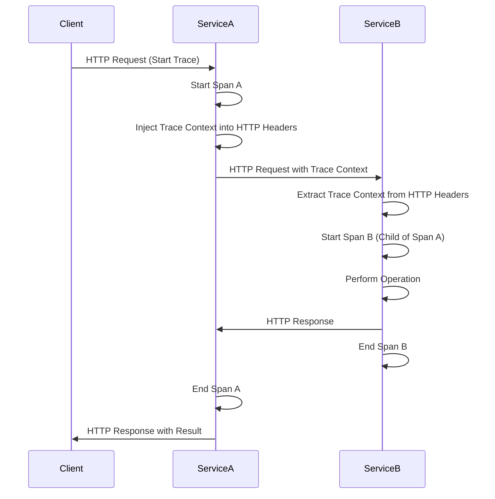
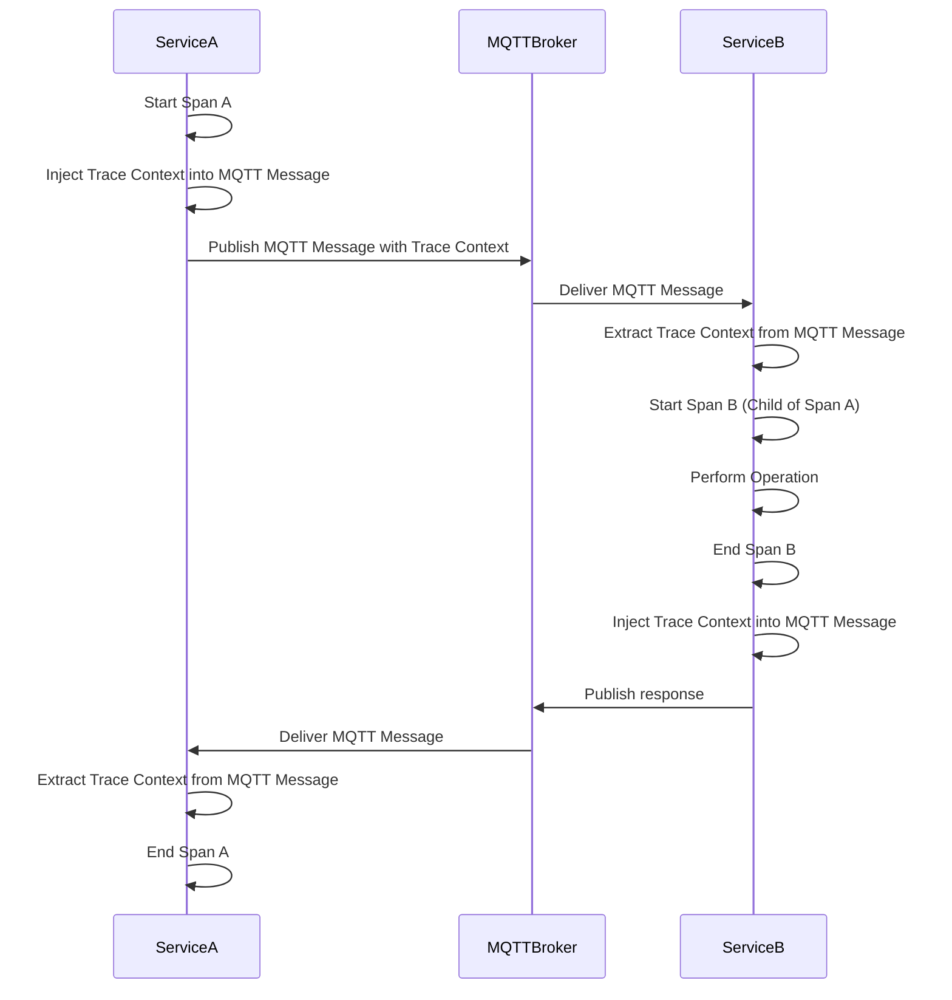

# Tracing | Cross-service propagation

Cross-service span propagation is a key concept in distributed tracing that enables the tracking 
of requests as they move through various services.

There are two general scenarios:

#### 1. Join an external span

This occurs when a service receives a request (response) or message that includes tracing context from an external source. 
The service then joins this existing trace, continuing the span from where it was left off.

#### 2. Propagate current span downstream 

This scenario involves a service injecting the trace context into outgoing requests or messages. 
This allows subsequent services to continue the trace, linking their spans to the parent span.

## Configuration

There are multiple propagators available out of the box:
- `tracecontext` - [W3C Trace Context](https://www.w3.org/TR/trace-context/)
- `baggage` - [W3C Baggage](https://www.w3.org/TR/baggage/)
- `b3` - [B3 Single](https://github.com/openzipkin/b3-propagation#single-header)
- `b3multi` - [B3 Multi](https://github.com/openzipkin/b3-propagation#multiple-headers)
- `jaeger` - [Jaeger](https://www.jaegertracing.io/docs/1.21/client-libraries/#propagation-format)

The `tracecontext` is the default propagator. The propagator can be configured via environment variables or system properties:
- `OTEL_PROPAGATORS=b3multi`
- `-Dotel.propagators=b3multi`

Multiple propagators can be enabled too, for example: `OTEL_PROPAGATORS=b3multi,tracecontext`.

`Otel4s#propagators` shows the configured propagators: 

@:select(otel-backend)

@:choice(oteljava)

```scala mdoc:silent
import cats.effect.IO
import org.typelevel.otel4s.oteljava.OtelJava

OtelJava.autoConfigured[IO]().use { otel4s =>
  IO.println("Propagators: " + otel4s.propagators)
}
// Propagators: ContextPropagators.Default{
//   textMapPropagator=[W3CTraceContextPropagator, W3CBaggagePropagator]
// }
```

@:choice(sdk)

```scala mdoc:silent
import cats.effect.IO
import org.typelevel.otel4s.sdk.OpenTelemetrySdk
import org.typelevel.otel4s.sdk.exporter.otlp.autoconfigure.OtlpExportersAutoConfigure

OpenTelemetrySdk
  .autoConfigured[IO](_.addExportersConfigurer(OtlpExportersAutoConfigure[IO]))
  .use { auto =>
    IO.println("Propagators: " + auto.sdk.propagators)  
  }
// Propagators: ContextPropagators.Default{
//   textMapPropagator=[W3CTraceContextPropagator, W3CBaggagePropagator]
// }
```

@:@

## Propagation scenarios

Let's take a look at a common cross-service propagation models.

#### HTTP



#### MQTT



## Propagate current span downstream

The `Tracer[F].propagate` injects current span details into the given carrier:
```scala
trait Tracer[F[_]] {
  def propagate[C: TextMapUpdater](carrier: C): F[C] 
}
```
Any carrier would work as long as `TextMapUpdater` is available for this type.
For example, `Map[String, String]` and `Seq[(String, String)]` work out of the box.

We can also implement a `TextMapUpdater` for arbitrary types, for example `org.http4s.Headers`:
```scala mdoc:silent
import cats.effect.IO
import org.http4s._
import org.http4s.client.Client
import org.http4s.syntax.literals._
import org.typelevel.ci.CIString
import org.typelevel.otel4s.context.propagation._
import org.typelevel.otel4s.trace.Tracer

implicit val headersTextMapUpdater: TextMapUpdater[Headers] = 
  new TextMapUpdater[Headers] {
    def updated(headers: Headers, key: String, value: String): Headers =
      headers.put(Header.Raw(CIString(key), value))
  }

def sendRequest(client: Client[IO])(implicit T: Tracer[IO]): IO[String] = 
  Tracer[IO].span("send-request").surround {
    val req = Request[IO](Method.GET, uri"http://localhost:8080")
    
    for  {
      traceHeaders <- Tracer[IO].propagate(Headers.empty)
      // Headers(traceparent: 00-82383569b2b84276342a70581dc625ad-083b7f94913d787a-01)

      // add trace headers to the request and execute it
      result <- client.expect[String](req.withHeaders(req.headers ++ traceHeaders))
    } yield result
  }
```

## Join an external span

The `Tracer[F].joinOrRoot` extracts span details from the carrier:
```scala
trait Tracer[F[_]] {
  def joinOrRoot[A, C: TextMapGetter](carrier: C)(fa: F[A]): F[A]
}
```

Similarly to the `TextMapUpdater`, we can implement a `TextMapGetter` for arbitrary types:
```scala mdoc:silent
import cats.effect.IO
import org.http4s._
import org.http4s.client.Client
import org.http4s.syntax.literals._
import org.typelevel.ci.CIString
import org.typelevel.otel4s.context.propagation._
import org.typelevel.otel4s.trace.Tracer

implicit val headersTextMapGetter: TextMapGetter[Headers] =
  new TextMapGetter[Headers] {
    def get(headers: Headers, key: String): Option[String] =
      headers.get(CIString(key)).map(_.head.value)
    def keys(headers: Headers): Iterable[String] =
      headers.headers.map(_.name.toString)
  }

def executeRequest(client: Client[IO])(implicit T: Tracer[IO]): IO[Unit] = {
  val req = Request[IO](Method.GET, uri"http://localhost:8080")
  
  client.run(req).use { response =>
    // use response's headers to extract tracing details 
    Tracer[IO].joinOrRoot(response.headers) {
      Tracer[IO].span("child-span").surround {
        for {
          body <- response.as[String]
          _ <- IO.println("body: " + body)
          // process response there
        } yield ()
      }
    }
  }
}
```

## Implementing a custom propagator

`TextMapPropagator` injects and extracts values in the form of text into carriers that travel in-band.

Let's say we use `platform-id` in the HTTP headers. 
We can implement a custom `TextMapPropagator` that will use `platform-id` header to carry the identifier.

@:select(otel-backend)

@:choice(oteljava)

```scala mdoc:reset:silent
import cats.effect._
import org.typelevel.otel4s.context.propagation._
import org.typelevel.otel4s.oteljava.context._

object PlatformIdPropagator extends TextMapPropagator[Context] {
  // the value will be stored in the Context under this key
  val PlatformIdKey: Context.Key[String] =
    Context.Key.unique[SyncIO, String]("platform-id").unsafeRunSync()

  val fields: Iterable[String] = List("platform-id")

  def extract[A: TextMapGetter](ctx: Context, carrier: A): Context =
    TextMapGetter[A].get(carrier, "platform-id") match {
      case Some(value) => ctx.updated(PlatformIdKey, value)
      case None        => ctx
    }

  def inject[A: TextMapUpdater](ctx: Context, carrier: A): A =
    ctx.get(PlatformIdKey) match {
      case Some(value) => TextMapUpdater[A].updated(carrier, "platform-id", value)
      case None        => carrier
    }
}
```

And wire it up:
```scala mdoc:silent
import org.typelevel.otel4s.oteljava.context.propagation.PropagatorConverters._
import io.opentelemetry.context.propagation.{TextMapPropagator => JTextMapPropagator}
import org.typelevel.otel4s.oteljava.OtelJava

OtelJava.autoConfigured[IO] { builder =>
  builder.addPropagatorCustomizer { (tmp, _) =>
    JTextMapPropagator.composite(tmp, PlatformIdPropagator.asJava)
  }
}
```

@:choice(sdk)

```scala mdoc:reset:silent
import cats.effect._
import org.typelevel.otel4s.context.propagation._
import org.typelevel.otel4s.sdk.context._

object PlatformIdPropagator extends TextMapPropagator[Context] {
  // the value will be stored in the Context under this key
  val PlatformIdKey: Context.Key[String] =
    Context.Key.unique[SyncIO, String]("platform-id").unsafeRunSync()
  
  val fields: Iterable[String] = List("platform-id")
  
  def extract[A: TextMapGetter](ctx: Context, carrier: A): Context =
    TextMapGetter[A].get(carrier, "platform-id") match {
      case Some(value) => ctx.updated(PlatformIdKey, value)
      case None        => ctx
    }
  
  def inject[A: TextMapUpdater](ctx: Context, carrier: A): A =
    ctx.get(PlatformIdKey) match {
      case Some(value) => TextMapUpdater[A].updated(carrier, "platform-id", value)
      case None        => carrier
    }
}
```

And wire it up:
```scala mdoc:silent
import org.typelevel.otel4s.sdk.OpenTelemetrySdk

OpenTelemetrySdk.autoConfigured[IO] { builder =>
  builder.addTracerProviderCustomizer((b, _) =>
    b.addTextMapPropagators(PlatformIdPropagator)
  )
}
```

@:@
