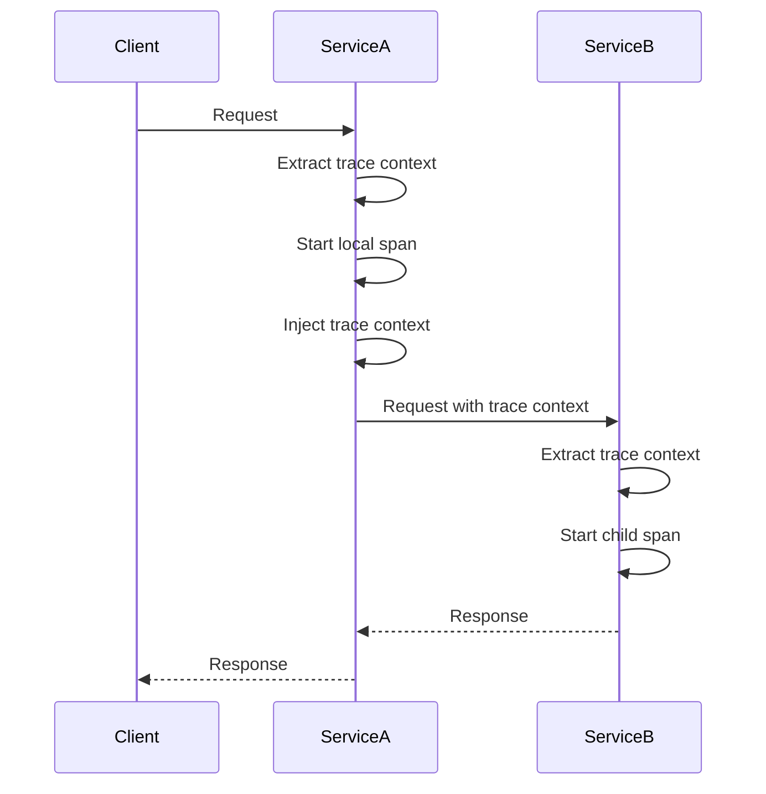

# Cross-service trace propagation

Trace propagation carries the current trace context through request or message metadata so another service can continue
the same trace.

Use [Propagate trace context across service boundaries](../how-to-tracing/propagate-trace-context-across-service-boundaries.md)
for the step-by-step `joinOrRoot` and `propagate` workflow. This page is a reference for propagation configuration,
carrier support, and custom propagators.

## Propagation model

There are two sides to cross-service propagation:

- **Extract** incoming context from a carrier, then run local work under that parent context.
- **Inject** current context into an outgoing carrier, then attach that carrier to the request or message sent downstream.

In otel4s, extraction is exposed through `Tracer[F].joinOrRoot`. Injection is exposed through `Tracer[F].propagate`.
Both operations use the propagators configured on the OpenTelemetry SDK.


```mermaid
sequenceDiagram
    participant Client
    participant ServiceA
    participant ServiceB

    Client->>ServiceA: Request
    ServiceA->>ServiceA: Extract trace context
    ServiceA->>ServiceA: Start local span
    ServiceA->>ServiceA: Inject trace context
    ServiceA->>ServiceB: Request with trace context
    ServiceB->>ServiceB: Extract trace context
    ServiceB->>ServiceB: Start child span
    ServiceB-->>ServiceA: Response
    ServiceA-->>Client: Response
```

The carrier depends on the protocol. HTTP usually uses headers. Messaging systems usually use message headers or
properties. otel4s only requires carrier-specific `TextMapGetter` and `TextMapUpdater` instances.

## Common carriers

Most propagation work starts by identifying where the protocol carries text metadata.

- HTTP: use request headers. Extract from incoming request headers and inject into outgoing request headers.
- gRPC: use metadata. Propagation fields are text values, so use regular ASCII metadata keys rather than binary
  metadata keys.
- Kafka: use record headers. Header values are bytes, so choose one text encoding, such as UTF-8, for propagation
  fields.
- MQTT 5: use user properties. They are text key-value pairs and fit the text-map propagation model.
- MQTT 3.x: there is no standard text metadata field equivalent to HTTP headers or MQTT 5 user properties. Use a
  wrapper message, broker-specific metadata, or another agreed carrier when trace propagation is required.

Once you have a carrier shape, the otel4s API is the same: provide `TextMapGetter` for extraction and
`TextMapUpdater` for injection.

## Built-in propagators

The OpenTelemetry Java backend can use these propagators out of the box:

| Name           | Format                                                                 |
|----------------|------------------------------------------------------------------------|
| `tracecontext` | [W3C Trace Context](https://www.w3.org/TR/trace-context/)              |
| `baggage`      | [W3C Baggage](https://www.w3.org/TR/baggage/)                          |
| `b3`           | [B3 single header](https://github.com/openzipkin/b3-propagation#single-header) |
| `b3multi`      | [B3 multiple headers](https://github.com/openzipkin/b3-propagation#multiple-headers) |
| `jaeger`       | [Jaeger](https://www.jaegertracing.io/docs/1.21/client-libraries/#propagation-format) |

`tracecontext` and `baggage` are the default propagators.

## Configure propagators

Configure propagators when the service must interoperate with systems that use a non-default propagation format.
Multiple propagators can be enabled with a comma-separated list.

@:select(config-source)

@:choice(env-vars)

```bash
export OTEL_PROPAGATORS=b3multi,tracecontext
```

@:choice(jvm-properties)

```bash
-Dotel.propagators=b3multi,tracecontext
```

@:@

`Otel4s#propagators` shows the configured propagators:

```scala mdoc:silent
import cats.effect.IO
import org.typelevel.otel4s.oteljava.OtelJava

OtelJava.autoConfigured[IO]().use { otel4s =>
  IO.println("Propagators: " + otel4s.propagators)
}
// Propagators: ContextPropagators.Default{
//   textMapPropagator=[W3CTraceContextPropagator, W3CBaggagePropagator]
// }
```

## Carrier support

`Map[String, String]` and `Seq[(String, String)]` work without additional code.

For other carrier types, define:

- `TextMapGetter[C]` when the carrier is used for extraction
- `TextMapUpdater[C]` when the carrier is used for injection

For a focused example using `org.http4s.Headers`, see
[Propagate trace context across service boundaries](../how-to-tracing/propagate-trace-context-across-service-boundaries.md).

## Custom propagators

Use a custom `TextMapPropagator` when you need to extract or inject a non-standard field into otel4s context.
The propagator decides which carrier keys it reads and writes, and how those values are represented in `Context`.

This example carries a `platform-id` value through text-map carriers:

```scala mdoc:reset:silent
import cats.effect._
import org.typelevel.otel4s.context.propagation._
import org.typelevel.otel4s.oteljava.context._

object PlatformIdPropagator extends TextMapPropagator[Context] {
  // the value will be stored in the Context under this key
  val PlatformIdKey: Context.Key[String] =
    Context.Key.unique[SyncIO, String]("platform-id").unsafeRunSync()

  val fields: Iterable[String] = List("platform-id")

  def extract[A: TextMapGetter](ctx: Context, carrier: A): Context =
    TextMapGetter[A].get(carrier, "platform-id") match {
      case Some(value) => ctx.updated(PlatformIdKey, value)
      case None        => ctx
    }

  def inject[A: TextMapUpdater](ctx: Context, carrier: A): A =
    ctx.get(PlatformIdKey) match {
      case Some(value) => TextMapUpdater[A].updated(carrier, "platform-id", value)
      case None        => carrier
    }
}
```

Register the custom propagator with the OpenTelemetry Java backend:

```scala mdoc:silent
import io.opentelemetry.context.propagation.{TextMapPropagator => JTextMapPropagator}
import org.typelevel.otel4s.oteljava.OtelJava
import org.typelevel.otel4s.oteljava.context.propagation.PropagatorConverters._

OtelJava.autoConfigured[IO] { builder =>
  builder.addPropagatorCustomizer { (configured, _) =>
    JTextMapPropagator.composite(configured, PlatformIdPropagator.asJava)
  }
}
```

## Related material

- Step-by-step propagation workflow:
  [Propagate trace context across service boundaries](../how-to-tracing/propagate-trace-context-across-service-boundaries.md)
- Baggage values:
  [Work with baggage](../how-to-tracing/work-with-baggage.md)
- Parent-span behavior:
  [Choosing parent spans and tracing scopes](../explanations/choosing-parent-spans-and-tracing-scopes.md)
