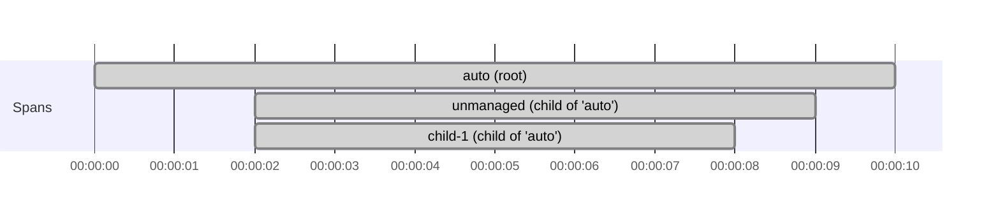
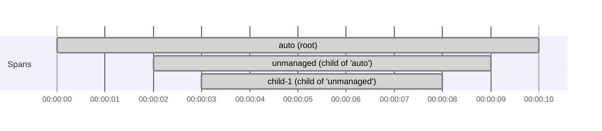

# Tracing

`Tracer` is an entry point to the tracing capabilities and instrumentation.
It provides various functionalities for creating and managing spans,
extracting context from carriers, propagating context downstream, and more.

### How to get the `Tracer`

Currently, `otel4s` has a backend built on top of [OpenTelemetry Java][opentelemetry-java].
Add the following configuration to the favorite build tool:

@:select(build-tool)

@:choice(sbt)

Add settings to the `build.sbt`:

```scala
libraryDependencies ++= Seq(
  "org.typelevel" %% "otel4s-oteljava" % "@VERSION@", // <1>
  "io.opentelemetry" % "opentelemetry-exporter-otlp" % "@OPEN_TELEMETRY_VERSION@" % Runtime, // <2>
  "io.opentelemetry" % "opentelemetry-sdk-extension-autoconfigure" % "@OPEN_TELEMETRY_VERSION@" % Runtime // <3>
)
javaOptions += "-Dotel.java.global-autoconfigure.enabled=true" // <4>
```

@:choice(scala-cli)

Add directives to the `*.scala` file:

```scala
//> using dep "org.typelevel::otel4s-oteljava:@VERSION@" // <1>
//> using dep "io.opentelemetry:opentelemetry-exporter-otlp:@OPEN_TELEMETRY_VERSION@" // <2>
//> using dep "io.opentelemetry:opentelemetry-sdk-extension-autoconfigure:@OPEN_TELEMETRY_VERSION@" // <3>
//> using javaOpt "-Dotel.java.global-autoconfigure.enabled=true" // <4>
```

@:@

1. Add the `otel4s-oteljava` library
2. Add an OpenTelemetry exporter. Without the exporter, the application will crash
3. Add an OpenTelemetry autoconfigure extension
4. Enable OpenTelemetry SDK [autoconfigure mode][opentelemetry-java-autoconfigure]

Once the build configuration is up-to-date, the `Tracer` can be created:

```scala mdoc:silent
import cats.effect.IO
import org.typelevel.otel4s.trace.Tracer
import org.typelevel.otel4s.oteljava.OtelJava

OtelJava.autoConfigured[IO]().evalMap { otel4s =>
  otel4s.tracerProvider.get("com.service").flatMap { implicit tracer: Tracer[IO] =>
    val _ = tracer // use tracer here
    ???
  }
}
```

@:callout(warning)

`OtelJava.autoConfigured` creates an **isolated** **non-global** instance.
If you create multiple instances, those instances won't interoperate (i.e. be able to see each others spans).

@:@

### Creating a span

You can use the `span` or `spanBuilder` API to create a new span.

The tracer automatically determines whether to create a child span or a root span based on the presence of a valid
parent in the tracing context.
If a valid parent is available, the new span becomes a child of it. Otherwise, it becomes a root span.

Here's how you can do it:

```scala mdoc:silent:reset
import cats.Monad
import cats.effect.Ref
import cats.syntax.flatMap._
import cats.syntax.functor._
import org.typelevel.otel4s.Attribute
import org.typelevel.otel4s.trace.Tracer

case class User(email: String)

class UserRepository[F[_]: Monad: Tracer](storage: Ref[F, Map[Long, User]]) {

  def findUser(userId: Long): F[Option[User]] =
    Tracer[F].span("find-user", Attribute("user_id", userId)).use { span =>
      for {
        current <- storage.get
        user <- Monad[F].pure(current.get(userId))
        _ <- span.addAttribute(Attribute("user_exists", user.isDefined))
      } yield user
    }

}
```

For how the current tracing context affects `span`, `childScope`, `rootScope`, `rootSpan`, and `noopScope`, see
[Root spans and tracing scopes](../explanations/root-spans-and-tracing-scopes.md).

### Starting an unmanaged span

The `Tracer[F].span(...)` automatically manages the lifecycle of the span. `Tracer[F].span("...").startUnmanaged` 
creates a span that must be ended **manually** by invoking `end`. This strategy can be used when it's necessary 
to end a span outside the scope (e.g. async callback). 

A few limitations:

**1. An unfinished span remains active indefinitely**

In the following example, the unmanaged span has never been terminated:
```scala mdoc:silent
import org.typelevel.otel4s.trace.StatusCode

def leaked[F[_]: Monad: Tracer]: F[Unit] =
  Tracer[F].spanBuilder("manual-span").build.startUnmanaged.flatMap { span =>
    span.setStatus(StatusCode.Ok, "all good")
  }
```

Properly ended span:
```scala mdoc:silent
def ok[F[_]: Monad: Tracer]: F[Unit] =
  Tracer[F].spanBuilder("manual-span").build.startUnmanaged.flatMap { span =>
    span.setStatus(StatusCode.Ok, "all good") >> span.end
  }
```

_______

**2. The span isn't propagated automatically**

Consider the following example:
```scala mdoc:silent
def nonPropagated[F[_]: Monad: Tracer]: F[Unit] = 
  Tracer[F].span("auto").surround {
    // 'unmanaged' is the child of the 'auto' span
    Tracer[F].span("unmanaged").startUnmanaged.flatMap { unmanaged =>
      // 'child-1' is the child of the 'auto', not 'unmanaged'  
      Tracer[F].span("child-1").use_ >> unmanaged.end
    }
  }
```

The structure is:

```mermaid
gantt
    dateFormat HH:mm:ss
    axisFormat %H:%M:%S

    section Spans
    auto (root)                    :done, a1, 00:00:00, 00:00:10
    unmanaged (child of 'auto')    :done, a2, 00:00:02, 00:00:09
    child-1 (child of 'auto')      :done, a3, 00:00:02, 00:00:08
```

Use `Tracer[F].childScope` to create a child of the unmanaged span: 
```scala mdoc:silent
def propagated[F[_]: Monad: Tracer]: F[Unit] = 
  Tracer[F].span("auto").surround {
    // 'unmanaged' is the child of the 'auto' span
    Tracer[F].span("unmanaged").startUnmanaged.flatMap { unmanaged => 
      Tracer[F].childScope(unmanaged.context) {
        // 'child-1' is the child of the 'unmanaged' span
        Tracer[F].span("child-1").use_ >> unmanaged.end
      }
    }
  }
```

The structure is:

```mermaid
gantt
    dateFormat HH:mm:ss
    axisFormat %H:%M:%S

    section Spans
    auto (root)                         :done, a1, 00:00:00, 00:00:10
    unmanaged (child of 'auto')         :done, a2, 00:00:02, 00:00:09
    child-1 (child of 'unmanaged')      :done, a3, 00:00:03, 00:00:08
```


### Tracing a resource

You can use `Tracer[F].span("...").resource` to create a managed span, but the effect inside `Resource.use` does not
automatically run with that span as current.

Use the `trace` function from `SpanOps.Res` to re-enter the span scope. If you need traced acquire and release steps,
combine `mapK(res.trace)` with `res.trace(...)` around the `use` body.

For the current guidance and examples, see:

- [Trace Resource and fs2.Stream code](../how-to-tracing/trace-resource-and-fs2-stream-code.md)
- [Tracing Resource and fs2.Stream scopes](../explanations/tracing-resource-and-fs2-stream-scopes.md)

### Tracing a stream

When you build a stream branch from `Tracer[F].span("...").resource`, use `fs2.Stream#translate` with the captured
`trace` function to run that branch in the expected span scope.

For the current guidance and examples, see:

- [Trace Resource and fs2.Stream code](../how-to-tracing/trace-resource-and-fs2-stream-code.md)
- [Tracing Resource and fs2.Stream scopes](../explanations/tracing-resource-and-fs2-stream-scopes.md)

[opentelemetry-java]: https://github.com/open-telemetry/opentelemetry-java

[opentelemetry-java-autoconfigure]: https://opentelemetry.io/docs/languages/java/configuration/
