# Tracing

`Tracer` is an entry point to the tracing capabilities and instrumentation.
It provides various functionalities for creating and managing spans,
extracting context from carriers, propagating context downstream, and more.

### How to get the `Tracer`

Currently, `otel4s` has a backend built on top of [OpenTelemetry Java][opentelemetry-java].
Add the following configuration to the favorite build tool:

@:select(build-tool)

@:choice(sbt)

Add settings to the `build.sbt`:

```scala
libraryDependencies ++= Seq(
  "org.typelevel" %% "otel4s-oteljava" % "@VERSION@", // <1>
  "io.opentelemetry" % "opentelemetry-exporter-otlp" % "@OPEN_TELEMETRY_VERSION@" % Runtime, // <2>
  "io.opentelemetry" % "opentelemetry-sdk-extension-autoconfigure" % "@OPEN_TELEMETRY_VERSION@" % Runtime // <3>
)
javaOptions += "-Dotel.java.global-autoconfigure.enabled=true" // <4>
```

@:choice(scala-cli)

Add directives to the `*.scala` file:

```scala
//> using dep "org.typelevel::otel4s-oteljava:@VERSION@" // <1>
//> using dep "io.opentelemetry:opentelemetry-exporter-otlp:@OPEN_TELEMETRY_VERSION@" // <2>
//> using dep "io.opentelemetry:opentelemetry-sdk-extension-autoconfigure:@OPEN_TELEMETRY_VERSION@" // <3>
//> using javaOpt "-Dotel.java.global-autoconfigure.enabled=true" // <4>
```

@:@

1. Add the `otel4s-oteljava` library
2. Add an OpenTelemetry exporter. Without the exporter, the application will crash
3. Add an OpenTelemetry autoconfigure extension
4. Enable OpenTelemetry SDK [autoconfigure mode][opentelemetry-java-autoconfigure]

Once the build configuration is up-to-date, the `Tracer` can be created:

```scala mdoc:silent
import cats.effect.IO
import org.typelevel.otel4s.trace.Tracer
import org.typelevel.otel4s.oteljava.OtelJava

OtelJava.autoConfigured[IO]().evalMap { otel4s =>
  otel4s.tracerProvider.get("com.service").flatMap { implicit tracer: Tracer[IO] =>
    val _ = tracer // use tracer here
    ???
  }
}
```

@:callout(warning)

`OtelJava.autoConfigured` creates an **isolated** **non-global** instance.
If you create multiple instances, those instances won't interoperate (i.e. be able to see each others spans).

@:@

### Creating a span

You can use the `span` or `spanBuilder` API to create a new span.

The tracer automatically determines whether to create a child span or a root span based on the presence of a valid
parent in the tracing context.
If a valid parent is available, the new span becomes a child of it. Otherwise, it becomes a root span.

Here's how you can do it:

```scala mdoc:silent:reset
import cats.Monad
import cats.effect.Ref
import cats.syntax.flatMap._
import cats.syntax.functor._
import org.typelevel.otel4s.Attribute
import org.typelevel.otel4s.trace.Tracer

case class User(email: String)

class UserRepository[F[_]: Monad: Tracer](storage: Ref[F, Map[Long, User]]) {

  def findUser(userId: Long): F[Option[User]] =
    Tracer[F].span("find-user", Attribute("user_id", userId)).use { span =>
      for {
        current <- storage.get
        user <- Monad[F].pure(current.get(userId))
        _ <- span.addAttribute(Attribute("user_exists", user.isDefined))
      } yield user
    }

}
```

### Starting a root span

A root span is a span that is not a child of any other span.
You can use `Tracer[F].rootScope` to wrap an existing effect or `Tracer[F].rootSpan` to explicitly start a new root
span:

```scala mdoc:silent
import cats.Monad
import cats.syntax.flatMap._
import cats.syntax.functor._

class UserRequestHandler[F[_]: Tracer: Monad](repo: UserRepository[F]) {
  private val SystemUserId = -1L

  def handleUser(userId: Long): F[Unit] =
    Tracer[F].rootScope(activateUser(userId))

  def handleUserInternal(userId: Long): F[Unit] =
    Tracer[F].rootSpan("handle-user").surround(activateUser(userId))

  private def activateUser(userId: Long): F[Unit] =
    for {
      systemUser <- repo.findUser(SystemUserId)
      user <- repo.findUser(userId)
      _ <- activate(systemUser, user)
    } yield ()

  private def activate(systemUser: Option[User], target: Option[User]): F[Unit] = {
    val _ = (systemUser, target) // some processing logic
    Monad[F].unit
  }
}
```

While the behavior seems similar, the outcome is notably different:

1. `Tracer[F].rootScope(activateUser(userId))` will create two **independent root** spans:

```mermaid
gantt
    dateFormat HH:mm:ss
    axisFormat %H:%M:%S

    section Span 1
    find-user { user_id = -1 }     :done, a1, 00:00:00, 00:00:10
    section Span 2
    find-user { user_id = 123 }    :done, a2, 00:00:00, 00:00:10
```



2. `Tracer[F].rootSpan("handle-user").surround(activateUser(userId))` will create two **child** spans:


### Running effect without tracing

If you want to disable tracing for a specific section of the effect, you can use the `Tracer[F].noopScope`.
This creates a no-op scope where tracing operations have no effect:

```scala mdoc:silent
class InternalUserService[F[_]: Tracer](repo: UserRepository[F]) {

  def findUserInternal(userId: Long): F[Option[User]] =
    Tracer[F].noopScope(repo.findUser(userId))

}
```

### Starting an unmanaged span

The `Tracer[F].span(...)` automatically manages the lifecycle of the span. `Tracer[F].span("...").startUnmanaged` 
creates a span that must be ended **manually** by invoking `end`. This strategy can be used when it's necessary 
to end a span outside the scope (e.g. async callback). 

A few limitations:

**1. An unfinished span remains active indefinitely**

In the following example, the unmanaged span has never been terminated:
```scala mdoc:silent
import org.typelevel.otel4s.trace.StatusCode

def leaked[F[_]: Monad: Tracer]: F[Unit] =
  Tracer[F].spanBuilder("manual-span").build.startUnmanaged.flatMap { span =>
    span.setStatus(StatusCode.Ok, "all good")
  }
```

Properly ended span:
```scala mdoc:silent
def ok[F[_]: Monad: Tracer]: F[Unit] =
  Tracer[F].spanBuilder("manual-span").build.startUnmanaged.flatMap { span =>
    span.setStatus(StatusCode.Ok, "all good") >> span.end
  }
```

_______

**2. The span isn't propagated automatically**

Consider the following example:
```scala mdoc:silent
def nonPropagated[F[_]: Monad: Tracer]: F[Unit] = 
  Tracer[F].span("auto").surround {
    // 'unmanaged' is the child of the 'auto' span
    Tracer[F].span("unmanaged").startUnmanaged.flatMap { unmanaged =>
      // 'child-1' is the child of the 'auto', not 'unmanaged'  
      Tracer[F].span("child-1").use_ >> unmanaged.end
    }
  }
```

The structure is:


Use `Tracer[F].childScope` to create a child of the unmanaged span: 
```scala mdoc:silent
def propagated[F[_]: Monad: Tracer]: F[Unit] = 
  Tracer[F].span("auto").surround {
    // 'unmanaged' is the child of the 'auto' span
    Tracer[F].span("unmanaged").startUnmanaged.flatMap { unmanaged => 
      Tracer[F].childScope(unmanaged.context) {
        // 'child-1' is the child of the 'unmanaged' span
        Tracer[F].span("child-1").use_ >> unmanaged.end
      }
    }
  }
```

The structure is:


### Tracing a resource

You can use `Tracer[F].span("resource").resource` to create a managed span.

@:callout(warning)

The span started by the `.resource` **isn't propagated automatically** to the resource closure.
The propagation doesn't work because `Resource` abstraction is leaky regarding the fiber context propagation.
Check out the [context](https://github.com/typelevel/otel4s/issues/194).

@:@

Consider the following example:
```scala mdoc:silent:reset
import cats.effect._
import cats.syntax.functor._
import org.typelevel.otel4s.trace.{Tracer, SpanOps}

def withResource[F[_]: Async: Tracer]: F[Unit] =
  Tracer[F].span("my-resource-span").resource.use { case SpanOps.Res(_, _) =>
    Tracer[F].currentSpanContext.void // returns `None`
  }
```
you must evaluate the inner effect within the `trace` to propagate span details:
```scala mdoc:compile-only
def withResource[F[_]: Async: Tracer]: F[Unit] =
  Tracer[F].span("my-resource-span").resource.use { case SpanOps.Res(_, trace) =>
    trace(Tracer[F].currentSpanContext).void // returns `Some(SpanContext{traceId="...", })`
  }
```


#### Structured spans

You can achieve structured spans in the following way:

```scala mdoc:silent
class Connection[F[_]: Tracer] {
  def use[A](f: Connection[F] => F[A]): F[A] =
    Tracer[F].span("use_conn").surround(f(this))
}

object Connection {
  def create[F[_]: Async: Tracer]: Resource[F, Connection[F]] = 
    Resource.make(
      Tracer[F].span("acquire").surround(Async[F].pure(new Connection[F]))
    )(_ => Tracer[F].span("release").surround(Async[F].unit))
}

class App[F[_]: Async: Tracer] {
  def withConnection[A](f: Connection[F] => F[A]): F[A] =
    (for {
      r <- Tracer[F].span("resource").resource
      c <- Connection.create[F].mapK(r.trace)
    } yield (r, c)).use { case (res, connection) =>
      res.trace(Tracer[F].span("use").surround(connection.use(f)))
    }  
}
```

The spans structure is:


```mermaid
gantt
    dateFormat HH:mm:ss
    axisFormat %H:%M:%S

    section Spans
    resource        :done, a1, 00:00:00, 00:00:10
    acquire         :done, a2, 00:00:00, 00:00:03
    use             :done, a3, 00:00:03, 00:00:08
    use_conn        :done, a4, 00:00:04, 00:00:08
    release         :done, a5, 00:00:08, 00:00:10
```

#### Acquire and release spans 

You can also use `res.trace` in combination with `Resource#mapK` to trace the acquire and release steps of a resource:
```scala mdoc:compile-only
class Transactor[F[_]]
class Redis[F[_]]

def createTransactor[F[_]: Async: Tracer]: Resource[F, Transactor[F]] =
  Resource.make(
    Tracer[F].span("transactor#acquire").surround(Async[F].pure(new Transactor[F]))
  )(_ => Tracer[F].span("transactor#release").surround(Async[F].unit))
  
def createRedis[F[_]: Async: Tracer]: Resource[F, Redis[F]] =
  Resource.make(
    Tracer[F].span("redis#acquire").surround(Async[F].pure(new Redis[F]))
  )(_ => Tracer[F].span("redis#release").surround(Async[F].unit))
  
def components[F[_]: Async: Tracer]: Resource[F, (Transactor[F], Redis[F])] =
  for {
    r <- Tracer[F].span("app_lifecycle").resource
    tx <- createTransactor[F].mapK(r.trace)
    redis <- createRedis[F].mapK(r.trace)
  } yield (tx, redis)

def run[F[_]: Async: Tracer]: F[Unit] =
  components[F].use { case (_ /*transactor*/, _ /*redis*/) =>
    Tracer[F].span("app_run").surround(Async[F].unit)
  }
```

The spans structure is:


```mermaid
gantt
    dateFormat HH:mm:ss
    axisFormat %H:%M:%S

    section app_lifecycle
    app_lifecycle      :done, a1, 00:00:00, 00:00:26
    transactor#acquire :done, a2, 00:00:00, 00:00:06
    redis#acquire      :done, a3, 00:00:06, 00:00:10
    redis#release      :done, a4, 00:00:15, 00:00:19
    transactor#release :done, a5, 00:00:19, 00:00:26
    
    section app_run
    app_run           :done, a6, 00:00:10, 00:00:15
```

Both `app_run` and `app_lifecycle` are unique and **not linked** to each other.

@:callout(warning)

The `app_lifecycle` span remains active until the resource is released. 
If created at app startup, its duration matches the application's lifetime. 

@:@

[opentelemetry-java]: https://github.com/open-telemetry/opentelemetry-java

[opentelemetry-java-autoconfigure]: https://opentelemetry.io/docs/languages/java/configuration/