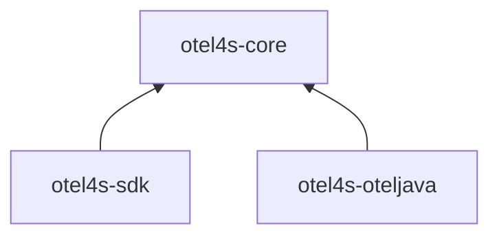
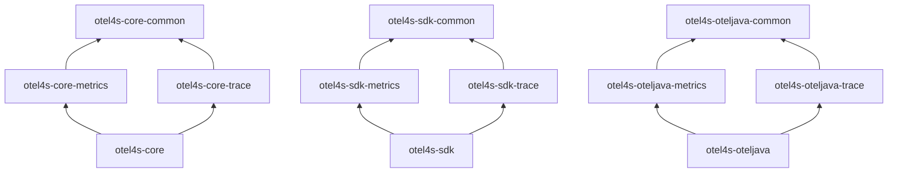

# Modules structure

The `otel4s` is designed with modularity in mind. To achieve this, the project is organized 
into distinct high-level modules, each serving specific purposes and functionalities. 
These modules are: `otel4s-core`, `otel4s-sdk`, `otel4s-oteljava`.

The primary motivation behind this modular architecture is to keep the classpath small. 

## High-level modules

### 1) `otel4s-core`

Defines the interfaces: [Tracer][tracer-github],
[Meter][meter-github], and others. 
It also offers no-op implementations.

### 2) `otel4s-sdk` 

The implementation of Open Telemetry specification written purely in Scala. 
Available for all platforms: JVM, Scala Native, Scala.js. 

### 3) `otel4s-oteljava` 

The implementation of `otel4s-core` interfaces. Uses [OpenTelemetry Java][otel-java] under the hood.

## High-level module structure

Each high-level module has several submodules:  
1. `{x}-common` - the shared code, used by `{x}-trace` and `{x}-metrics`  
2. `{x}-trace` - the tracing-specific code  
3. `{x}-metrics` - the metrics-specific code  
4. `{x}` - the high-level module itself - aggregates all of the above  

The current structure of the modules:

## Which module do I need?

Let's take a look into common scenarios:

1. You develop a library, and you will use only trace-specific interfaces - use `otel4s-core-trace`  
2. You develop a library, and you will use both tracing and metrics interfaces - use `otel4s-core`  
3. You develop an app and want to export your telemetry - use `otel4s-oteljava` module  

[tracer-github]: https://github.com/typelevel/otel4s/blob/main/core/trace/src/main/scala/org/typelevel/otel4s/trace/Tracer.scala
[meter-github]: https://github.com/typelevel/otel4s/blob/main/core/metrics/src/main/scala/org/typelevel/otel4s/metrics/Meter.scala
[otel-java]: https://github.com/open-telemetry/opentelemetry-java
