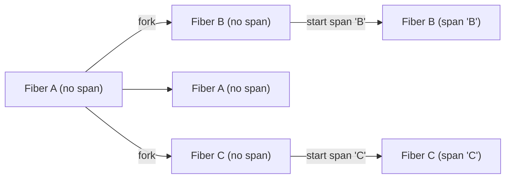

# Tracing context propagation

The tracing context propagation logic revolves around [cats.mtl.Local][mtl-local] semantics:
```scala
trait Local[F[_], E] {
  def ask: F[E]
  def local(fa: F[A])(f: E => E): F[A]
}
```

It allows us to express and manage local modifications of the tracing context within effectful computations.

`Local` works out of the box with the [cats.data.Kleisli][kleisli].
It also works with [cats.effect.IOLocal][io-local] with a little help.

Here is an example of how the span propagation works:


## How to choose the context carrier

In the vast majority of cases, `IOLocal` is the preferred and efficient way to propagate the context.
You can find both examples below and choose which one suits your requirements. 

### 1. IOLocal

```scala mdoc:silent:reset
import cats.effect._
import cats.mtl.Local
import cats.syntax.flatMap._
import org.typelevel.otel4s.instances.local._ // brings Local derived from IOLocal
import org.typelevel.otel4s.oteljava.context.Context
import org.typelevel.otel4s.oteljava.OtelJava
import io.opentelemetry.api.GlobalOpenTelemetry

def createOtel4s[F[_]: Async](implicit L: Local[F, Context]): F[OtelJava[F]] =
  Async[F].delay(GlobalOpenTelemetry.get).flatMap(OtelJava.fromJOpenTelemetry[F])
    
def program[F[_]: Async](otel4s: OtelJava[F]): F[Unit] = {
  val _ = otel4s
  Async[F].unit
}

val run: IO[Unit] =
  IOLocal(Context.root).flatMap { implicit ioLocal: IOLocal[Context] =>
    createOtel4s[IO].flatMap(otel4s => program(otel4s))
  }
```

If you don't need direct access to the `IOLocal` instance, there is also a shortcut `OtelJava.fromJOpenTelemetry`:

```scala mdoc:silent:reset
import cats.effect._
import cats.syntax.flatMap._
import org.typelevel.otel4s.oteljava.OtelJava
import io.opentelemetry.api.GlobalOpenTelemetry

def createOtel4s[F[_]: Async: LiftIO]: F[OtelJava[F]] =
  Async[F].delay(GlobalOpenTelemetry.get).flatMap(OtelJava.fromJOpenTelemetry[F])

def program[F[_]: Async](otel4s: OtelJava[F]): F[Unit] = {
  val _ = otel4s
  Async[F].unit
}

val run: IO[Unit] =
  createOtel4s[IO].flatMap(otel4s => program(otel4s))
```

Of even shorter with `OtelJava.global`: 
```scala mdoc:silent:reset
import cats.effect._
import org.typelevel.otel4s.oteljava.OtelJava

def program[F[_]: Async](otel4s: OtelJava[F]): F[Unit] = {
  val _ = otel4s
  Async[F].unit
}

val run: IO[Unit] =
  OtelJava.global[IO].flatMap(otel4s => program(otel4s))
```

### 2. Kleisli

```scala mdoc:silent:reset
import cats.effect._
import cats.syntax.flatMap._
import cats.data.Kleisli
import cats.mtl.Local
import org.typelevel.otel4s.oteljava.context.Context
import org.typelevel.otel4s.oteljava.OtelJava
import io.opentelemetry.api.GlobalOpenTelemetry

def createOtel4s[F[_]: Async](implicit L: Local[F, Context]): F[OtelJava[F]] =
  Async[F].delay(GlobalOpenTelemetry.get).flatMap(OtelJava.fromJOpenTelemetry[F])
    
def program[F[_]: Async](otel4s: OtelJava[F]): F[Unit] = {
  val _ = otel4s
  Async[F].unit
}

val kleisli: Kleisli[IO, Context, Unit] = 
  createOtel4s[Kleisli[IO, Context, *]].flatMap(otel4s => program(otel4s))

val run: IO[Unit] = kleisli.run(Context.root)
```

## Limitations

The current encoding of [cats.effect.Resource][resource] is incompatible with `Local` semantics.
For example, it's impossible to trace different stages of the resource (e.g. acquire, use, release) **and** 
stay within the resource. A similar situation is with `fs2.Stream`.

For example, you cannot get the following structure of the traces without allocation of the resource:
```
> resource
  > acquire
  > use
    > inner spans
  > release
```

To make it partially work, you need to trace each stage explicitly:
```scala
def acquire: F[Connection[F]] = ???
def release(c: Connection[F]): F[Unit] = ???

val resource: Resource[F, Connection[F]] = 
  Resource.make(Tracer[F].span("acquire-connection").surround(acquire)) { connection =>
    Tracer[F].span("release").surround(release(connection))
  }

def useConnection(c: Connection[F]): F[Unit] =
  ???

val io: F[Unit] = Tracer[F].span("resource").surround(
  resource.use { connection =>
    Tracer[F].span("use").surround(useConnection(connection))
  }
)
```


[mtl-local]: https://typelevel.org/cats-mtl/mtl-classes/local.html
[io-local]: https://typelevel.org/cats-effect/docs/core/io-local
[kleisli]: https://typelevel.org/cats/datatypes/kleisli.html
[resource]: https://typelevel.org/cats-effect/docs/std/resource